# `Spark—SQL`源码分析

------

## 章节`31`：`Spark—SQL`源码，`SQL`解析，`Dataset`到`RDD`的执行计划

------

### 序言

`SQL`解析，如果想实现`SQL`的话，要经历一个步骤。最终其实变成`RDD`，也就是我们未来要明白的一个软件框架，它能让你写`SQL`，它自主的还能帮你把`SQL`转成一些计算程序把它跑起来。其实这个意义是很大的，因为以前可能写`SQL`，那个`SQL`再怎么写它也是交给引擎，也就是数据库去执行。那么现在其实完全可以把`Spark—SQL`想成整个的一个数据库，就是`SQL`不只是交给了一个你看不到的东西而是你现在要分析他其中怎么去做的？

------

### 一、入口点

首先思考一下，在`Spark—CORE`时入口点是`SparkContext`，在`Spark—SQL`时入口点是`SparkSession`。那么为什么不是继续使用`SparkContext`？因为`SparkContext`只是创建`RDD`，但是它并没有能力去创建`SQL`解析这些能力。所以在基于兼容之前的`SparkContext`情况下，它用`SparkSession`其实包装了`SparkContext`的过程。也就是在原有的基础之上用包了一些进去。

一个是`SparkSession`另一个维度在`Spark—CORE`时，它的编程模型是`RDD`，基于`RDD`之上的一些转换和操作。那么其实我们在写的时候知道了它有一个东西叫`Dataset`或`DataFrame`。是以这个编程模型而不是使用`RDD`的编程模型。简单说`DataFrame`其实就是对`SQL`一方面的无论是`API`级还是这个字符串解析级的支持并扩充了`RDD`的一些能力，而且其实内部还有一些优化。

所以第一个入口点先去分析`SparkSession`，因为都是通过`SparkSession`得到的`Dataset`和`DataFrame`，所以他们两个有一个前后顺序和因果关系。

#### 1.1————`SparkSession`

通过`getOrCreate()`进入`sessionState`

```scala
/**
 * State isolated across sessions, including SQL configurations, temporary tables, registered
 * functions, and everything else that accepts a [[org.apache.spark.sql.internal.SQLConf]].
 * If `parentSessionState` is not null, the `SessionState` will be a copy of the parent.
 *
 * This is internal to Spark and there is no guarantee on interface stability.
 *
 * @since 2.2.0
 */
@InterfaceStability.Unstable
@transient
lazy val sessionState: SessionState = {
  parentSessionState
    .map(_.clone(this))
    .getOrElse {
      val state = SparkSession.instantiateSessionState(
        SparkSession.sessionStateClassName(sparkContext.conf),
        self)
      initialSessionOptions.foreach { case (k, v) => state.conf.setConfString(k, v) }
      state
  }
}
```

经由`sessionStateClassName()`到`hive`或`in-memory`模式匹配

```scala
private def sessionStateClassName(conf: SparkConf): String = {
  conf.get(CATALOG_IMPLEMENTATION) match {
    case "hive" => HIVE_SESSION_STATE_BUILDER_CLASS_NAME
    case "in-memory" => classOf[SessionStateBuilder].getCanonicalName
  }
}
```

进入`instantiateSessionState()`中的`builder()`

```scala
/**
 * Build the [[SessionState]].
 */
def build(): SessionState = {
  new SessionState(
    session.sharedState,
    conf,
    experimentalMethods,
    functionRegistry,
    udfRegistration,
    () => catalog,
    sqlParser,
    () => analyzer,
    () => optimizer,
    planner,
    streamingQueryManager,
    listenerManager,
    () => resourceLoader,
    createQueryExecution,
    createClone)
}
```

可以看到传递了很多参数。进入`SessionState`中的`QueryExecution.scala`中会发现，类中的成员属性均为`lazy`。

整个的流程大概为：一个逻辑计划进来后确认绑定元数据`→`得到元数据后再去优化`→`优化完后再转物理计划`→`转物理计划之后`→`得到`RDD`最终再执行。

整个的一颗语法树，最开始时，因为现在并没有涉及到`SQL`中文本字符串环节。相当于是`API`级。

`Dataset`是`ofRows`的私有属性？并不是。

因为`Dataset`是一个`object`，`Scala`中有`object`和`class`定义，所以它是一个伴生关系。然后在`Dataset`的`object`中，它会有一个`ofRows`，`ofRows`中是一个`Dataset`必须给它一个逻辑计划`logicalPlan`。且他必须要把逻辑计划传递给在`SparkSession`中的`sessionState.executePlan()`参数最终指向的是`createQueryExecution()`，`executePlan()`会接收一个计划`logicalPlan`，并且逻辑计划未来会和一些懒惰的小伙伴儿有一些依赖关系。只不过在`executePlan(logicalPlan)`时得到了`QueryExecution`但是它们并不会被执行，只得到一个`query`对象，这个对象只是持有了这个逻辑计划，也就是说在整个流程当中其实最终的目的是让`Dataset`中，因为构造时会发现其中传的并不是把一个逻辑计划传进去，它要传一个`QueryExecution`。但是`QueryExecution`要接收一个逻辑计划，作为参数才能完成它的构造这个对象。那么这个逻辑计划怎么来的？来自于`LogicalRelation`最终就制造出了一个`QueryExecution`，但是它怎么去用？

后续分析转换算子时更容易理解，最终得出结论`Dataset`必须要持有一个`qe`。在某一时刻这些懒惰的东西会被执行起来这是未来会发生的事情。

#### 1.2————总体思路

整个核心`Spark`没有变，就是`SparkContext`然后只包了一个`SparkSession`，最主要的目的是`QueryExecution`。以及逻辑计划树，其实它其中的`QueryExecution`贯穿了整个以`Dataset`编程模型对象包装的最核心的。如果用户通过`SparkSession`得到`Dataset`时，它的第一个贴源`Dataset`代表的是数据源。什么叫转换算子？如果拿着这个贴源的`Dataset`调转换算子之后，转换算子通用会调`withTypePlan`，然后会得到一个新的`Dataset`，这个`Dataset`的过程中所转换的加工逻辑会结合之前的`QueryExecution`封装出一个样例类，并继续向后传递变成一个`QueryExecution`。

并且一直都可以这样转换下去，但是到最后时候到某一个`Dataset`上，如果调了`Action`算子，它会基于最后这个`QueryExecution`得到物理执行计划，且在物理执行计划中得到`RDD`。

此时会发现跳过了中间很多优化的环节，直接从前面的`API`代码较为生硬得到逻辑计划，然后就是物理计划，然后得到`RDD`。

首先从逻辑计划变成物理计划，然后得到`RDD`的过程大体分析完毕。

##### 1.2.1—————`SparkPlan`

在`SparkPlan`中的`getByteArrayRdd()`里，一进来就调自己的`execute()`，这步就会得到`RDD`。只不过这个`RDD`要再做一次加工，加工的算子是`mapPartitionsInternal`，最终返回的也是一个`RDD`。

在`executor()`中调了`doExecute()`，进入后会返现没有实现了，因为子类具体的物理执行计划来实现此方法。

------

## 章节`32`：`Spark—SQL`源码，`ANTLRV4`的`SQL`解析，`AST`语法树的逻辑到物理转换

------

### 前言

上一个章节其实**不包含`ANTLRV4`语法解析**，直接分析了后续的通过`API`，每个`DataFrame`其实就包含了一个逻辑执行计划。这个计划是一棵树且要翻转。

本章先分析收到一个字符串，它是怎么完成这棵树的演变过程的？

进入`SQL`解析的途径有很多种。上一章分析的是`API`级，本章分析`SQL`级。他人传入`SQL`字符串后我们如何处理？

在`SQL`解析过程中有很多技术可以实现，那么目前的`2.x`之前的版本中，使用了`ANTLRV4`技术。一般很多技术都会拿它来做这种解析或是编译及语法解析的过程。

------

### 一、`ANTLRV4`

首先要创建一个**`.g4`为扩展名的文件**。为什么要先得到这个文件？

整体上来说，比如`Java`或`C`语言，其实都还有写数据库写`SQL`。其实这三个有点相似，因为我们都是作为人去写出一些字符串，但是这些字符串它就是字符串，它不能执行也不能有一些真正的逻辑在其中。那么最终它是怎么能执行起来的？

`SQL`怎么变成程序，`Java`怎么变成字节码，然后`SQL`怎么变成底层的一个数据库的查询？

它中间加了一个环节，就是编译我们写的字符串，这其中有两个词

- 字符串文本
- 编译

那么这个文本交给一个编译时，其实这其中有一个东西叫做语法。不能乱写否则编译器无法识别。可以**开发一个程序**，也可以不用开发这个程序像一个工厂一样，它**读取一个配置文件**，或者叫一个语法文件。得到规则，**其实就是把文法语法和解析器程序分开了**。

分词和语法可以分开写也可以写在一个文件中。

#### 1.1————简单的示例

```sql
// grammar 后的名字必须与文件名相同
grammar test;

tsinit : '{' value (',' value)* '}';

value : INT
      | tsinit;

// 可以是 0-9的一个或多个数字
INT : [0-9]+;
// 忽略一个或多个空白字符
WS : [ \t\r\n]+ -> skip;
```

效果如下图


`Spark—SQL`的默认解析文件`D:\ideaProject\sourcecodelearn\spark-2.3.4\sql\catalyst\src\main\antlr4\org\apache\spark\sql\catalyst\parser\SqlBase.g4`，用户先要学习语法，语法其实也是最终生成解析器的东西。这么做的目的其实是为了解耦。

可以通过`ANTLRV4`生成对应的文法此法的类。

#### 1.2————`SparkSession`的`def sql`

进入`parsePlan()`中

```scala
/**
 * Executes a SQL query using Spark, returning the result as a `DataFrame`.
 * The dialect that is used for SQL parsing can be configured with 'spark.sql.dialect'.
 *
 * @since 2.0.0
 */
def sql(sqlText: String): DataFrame = {
  Dataset.ofRows(self, sessionState.sqlParser.parsePlan(sqlText))
}
```

最终会追到`ParseDriver.scala`

```scala
/** Creates LogicalPlan for a given SQL string. */
override def parsePlan(sqlText: String): LogicalPlan = parse(sqlText) { parser =>
  astBuilder.visitSingleStatement(parser.singleStatement()) match {
    case plan: LogicalPlan => plan
    case _ =>
      val position = Origin(None, None)
      throw new ParseException(Option(sqlText), "Unsupported SQL statement", position, position)
  }
}

protected def parse[T](command: String)(toResult: SqlBaseParser => T): T = {
  logDebug(s"Parsing command: $command")

  val lexer = new SqlBaseLexer(new UpperCaseCharStream(CharStreams.fromString(command)))
  lexer.removeErrorListeners()
  lexer.addErrorListener(ParseErrorListener)

  val tokenStream = new CommonTokenStream(lexer)
  val parser = new SqlBaseParser(tokenStream)
  parser.addParseListener(PostProcessor)
  parser.removeErrorListeners()
  parser.addErrorListener(ParseErrorListener)
  
  try {
    try {
      // first, try parsing with potentially faster SLL mode
      parser.getInterpreter.setPredictionMode(PredictionMode.SLL)
      toResult(parser)
    }
    catch {
      case e: ParseCancellationException =>
      // if we fail, parse with LL mode
      tokenStream.seek(0) // rewind input stream
      parser.reset()

      // Try Again.
      parser.getInterpreter.setPredictionMode(PredictionMode.LL)
      toResult(parser)
    }
  }
  catch {
    case e: ParseException if e.command.isDefined =>
      throw e
    case e: ParseException =>
      throw e.withCommand(command)
    case e: AnalysisException =>
      val position = Origin(e.line, e.startPosition)
      throw new ParseException(Option(command), e.message, position, position)
  }
}
```

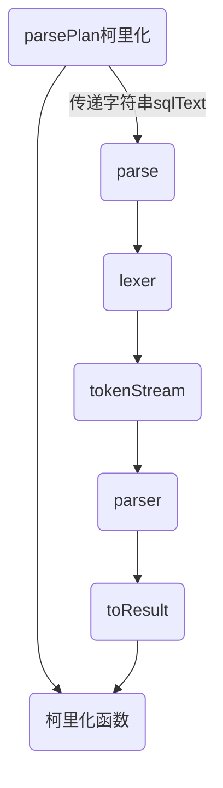

并且`singleStatement`就是`D:\ideaProject\sourcecodelearn\spark-2.3.4\sql\catalyst\src\main\antlr4\org\apache\spark\sql\catalyst\parser\SqlBase.g4`中的第`43`行。

------

### 二、`Analyzed`

如果得到了一颗文法树都是一些字符串，这其中字符串最后不能说对着一个`table1`的三个字母就能查出数据来，`table1`这种有元数据关联规则的。可以根据规则去拿字面的`table1`最重要取出它元数据的东西也就是真正的那个位置是读哪个文件还是读什么地方的数据才能把数据加载出来，这是要绑定一次元数据的过程。也就是图当中它的下一步`analyzed`是要和元数据去绑定的，而且要条件反射`Spark`的元数据，它其实自己维护了一个`cataLog`。

`cataLog`中维护一些基于`Memory`的这种临时`Application`级别的创建一些`tempView`，然后也可以来自于一个`internal`外部的一些，比如`Hive`中的元数据。都可以在这个环节中去绑定刚才的生成`SQL`那个字符串的树去做一次绑定和扩充。

那么如何去做？还是回到`SparkSession`。进入`ofRows()`

```scala
def sql(sqlText: String): DataFrame = {
  Dataset.ofRows(self, sessionState.sqlParser.parsePlan(sqlText))
}
```

可以看到

```scala
def ofRows(sparkSession: SparkSession, logicalPlan: LogicalPlan): DataFrame = {
  val qe = sparkSession.sessionState.executePlan(logicalPlan)
  qe.assertAnalyzed()
  new Dataset[Row](sparkSession, qe, RowEncoder(qe.analyzed.schema))
}
```

进入`assertAnalyzed()`，会发现

```scala
def assertAnalyzed(): Unit = analyzed
```

此方法并不是懒执行的，间接调了`analyzed`

```scala
lazy val analyzed: LogicalPlan = {
  SparkSession.setActiveSession(sparkSession)
  // 依旧是通过 sessionState 检查逻辑计划
  sparkSession.sessionState.analyzer.executeAndCheck(logical)
}
```

在得到`QueryExecution`后，第一步就是解析且每个`Dataset`都会完成这一步。但是剩下的要在`Action`算子触发时才会被执行。

最终一定会得到`executedPlan.execute()`时才会逆推向上执行。但是`Analyzed`一定是优先被执行。

进入`executeAndCheck(logical)`会发现在`Analyzer.scala`类中继承了`RuleExecutor`定义了很多规则。`Analyzer`中有`cataLog`会有元数据。

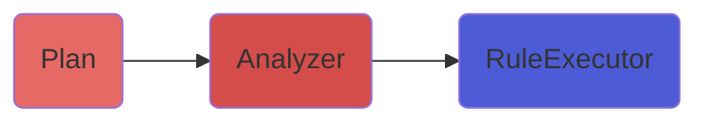

其中会有很多规则，这些规则在遍历的时候会作用在`Plan`上，`batches`就是遍历规则。

```scala
def apply(plan: LogicalPlan): LogicalPlan = plan.transformUp {
  case i @ InsertIntoTable(u: UnresolvedRelation, parts, child, _, _) if child.resolved =>
    EliminateSubqueryAliases(lookupTableFromCatalog(u)) match {
      case v: View =>
        u.failAnalysis(s"Inserting into a view is not allowed. View: ${v.desc.identifier}.")
      case other => i.copy(table = other)
    }
  case u: UnresolvedRelation => resolveRelation(u)
}
```

一种方式为`UnresolvedRelation => resolveRelation(u)`转换过程，可以缔造出一个`Dataset`。

```scala
def resolveRelation(plan: LogicalPlan): LogicalPlan = plan match {
  // 如果还有和元数据做关联
  case u: UnresolvedRelation if !isRunningDirectlyOnFiles(u.tableIdentifier) =>
    val defaultDatabase = AnalysisContext.get.defaultDatabase
    // 寻找关系, table1 在什么位置
    // 最终就是找 lookupTableFromCatalog(u, defaultDatabase)
    val foundRelation = lookupTableFromCatalog(u, defaultDatabase)
    resolveRelation(foundRelation)
    // The view's child should be a logical plan parsed from the `desc.viewText`, the variable
    // `viewText` should be defined, or else we throw an error on the generation of the View
    // operator.
    case view @ View(desc, _, child) if !child.resolved =>
      // Resolve all the UnresolvedRelations and Views in the child.
      val newChild = AnalysisContext.withAnalysisContext(desc.viewDefaultDatabase) {
        if (AnalysisContext.get.nestedViewDepth > conf.maxNestedViewDepth) {
          view.failAnalysis(s"The depth of view ${view.desc.identifier} exceeds the maximum " +
            s"view resolution depth (${conf.maxNestedViewDepth}). Analysis is aborted to " +
            s"avoid errors. Increase the value of ${SQLConf.MAX_NESTED_VIEW_DEPTH.key} to work " +
            "around this.")
        }
        executeSameContext(child)
      }
      view.copy(child = newChild)
    case p @ SubqueryAlias(_, view: View) =>
      val newChild = resolveRelation(view)
      p.copy(child = newChild)
    case _ => plan
}
```

**最终可以看出`Analyzed`就是在做元数据的绑定的过程。**

在开启`SparkonHive`后，其实就可以`s.sql()`写`SQL`，没有一个所谓的注册表的过程。所以这两个过程当中就是符合刚才代码中在查找元数据时

- 本地有了，就取本地的。
- 本地没有，就取外部的元数据，然后查询取回并做一次绑定。

------

### 三、总结

在平时开发时，我们用什么？

第一种是用写字符串的方式，也就是`SparkSession`。然后调用它的`sql()`，可以传递给它一个简单的也可以是复杂的`SQL`语句。此时要注意，调用后先转变成一个所谓的逻辑计划，换言之这个计划可以是一颗简单的树也可以是一颗复杂的树。

这其中有两个概念，一个是`Dataset`一个是`Plan`，这两个维度。这是一个写`SQL`的方式。

第二种方式是我们可以通过`Dataset API`，如果得到了一个`Dataset`可以在上面调用一系列的诸如`.filter()`等方法。`Dataset`它是我们编程人员的一个对象，但此时如果再进一步思考

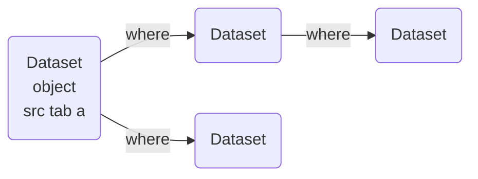

后续的所有操作面向`Plan`。

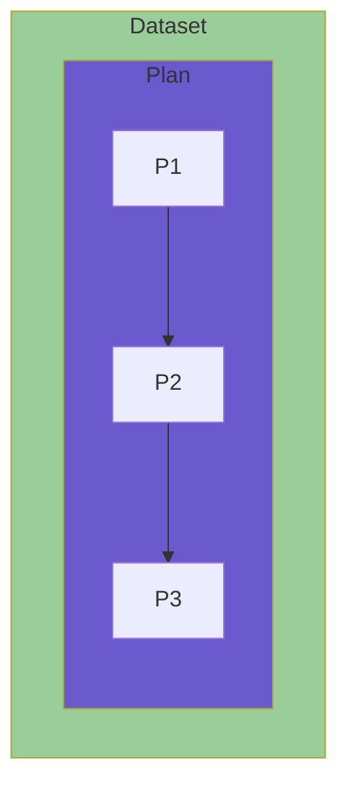

最终衔接的并不是`Dataset`而是`Plan`逻辑计划。

------

## 章节`33`：`Spark—SQL`源码，逻辑计划，优化器，物理计划，转换`RDD`

------

### 一、`Analyzer`的过程

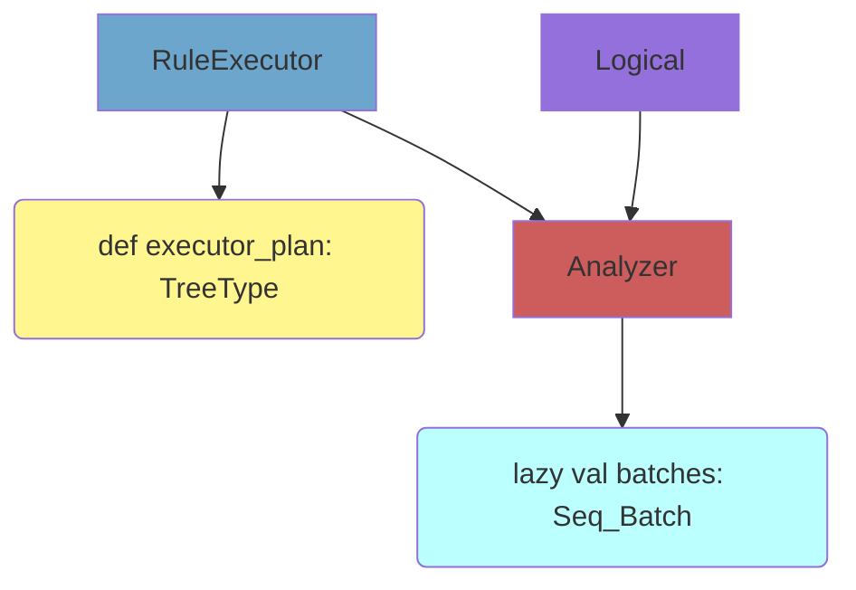

详细过程在`Spark—SQL@图解.pos`。

这就是`Analyzer`的过程，这样树就可以由文本字符串树转成包含元数据信息的树。至此，在转换完成后所有的`Dataset`准备完毕。

以上阶段在**提交`SQL`得到`DF/DS`、`API`得到`DF/DS`时间点触发。**

后一个阶段在**`withAction`时间点触发**。

### 1.1————优化器要做的事

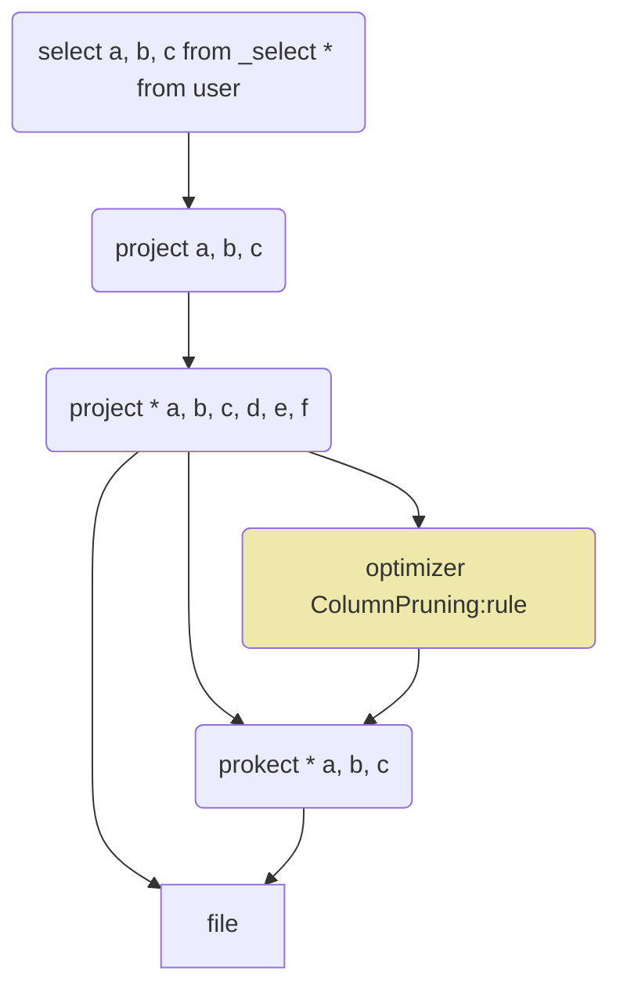

以上即为优化器的任务。

------

### 二、`withAction`阶段

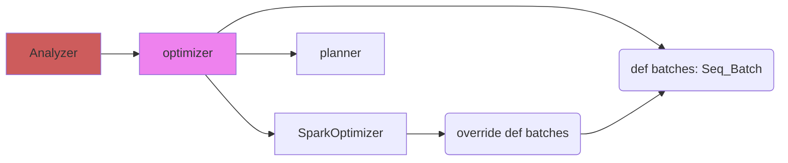

也就是说，宏观过程为

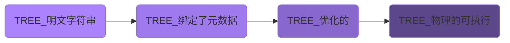

其实说白了就是从字符串文本带一个转变过程。以上为分析`withAction`算子的第一个柯里化也就是`qe`。

```scala
/**
 * Returns the first `n` rows.
 *
 * @note this method should only be used if the resulting array is expected to be small, as
 * all the data is loaded into the driver's memory.
 *
 * @group action
 * @since 1.6.0
 */
def head(n: Int): Array[T] = withAction("head", limit(n).queryExecution)(collectFromPlan)

/**
 * Wrap a Dataset action to track the QueryExecution and time cost, then report to the
 * user-registered callback functions.
 */
private def withAction[U](name: String, qe: QueryExecution)(action: SparkPlan => U) = {
  try {
    qe.executedPlan.foreach { plan =>
      plan.resetMetrics()
    }
    val start = System.nanoTime()
    val result = SQLExecution.withNewExecutionId(sparkSession, qe) {
      action(qe.executedPlan)
    }
    val end = System.nanoTime()
    sparkSession.listenerManager.onSuccess(name, qe, end - start)
    result
  } catch {
    case e: Exception =>
      sparkSession.listenerManager.onFailure(name, qe, e)
      throw e
  }
}
```

`qe`触发了一个`executedPlan`。

------

### 三、转换的过程

逻辑计划中的`Filter`很小，并没有太多东西。

```scala
case class Filter(condition: Expression, child: LogicalPlan)
  extends UnaryNode with PredicateHelper {
  override def output: Seq[Attribute] = child.output

  override def maxRows: Option[Long] = child.maxRows

  override protected def validConstraints: Set[Expression] = {
    val predicates = splitConjunctivePredicates(condition)
      .filterNot(SubqueryExpression.hasCorrelatedSubquery)
    child.constraints.union(predicates.toSet)
  }
}
```

如果一旦调用了`QueryExecution`最后的`executedPlan`，是需要先通过一个`Plan`对我们刚才转换完那个优化的树做一个处理。

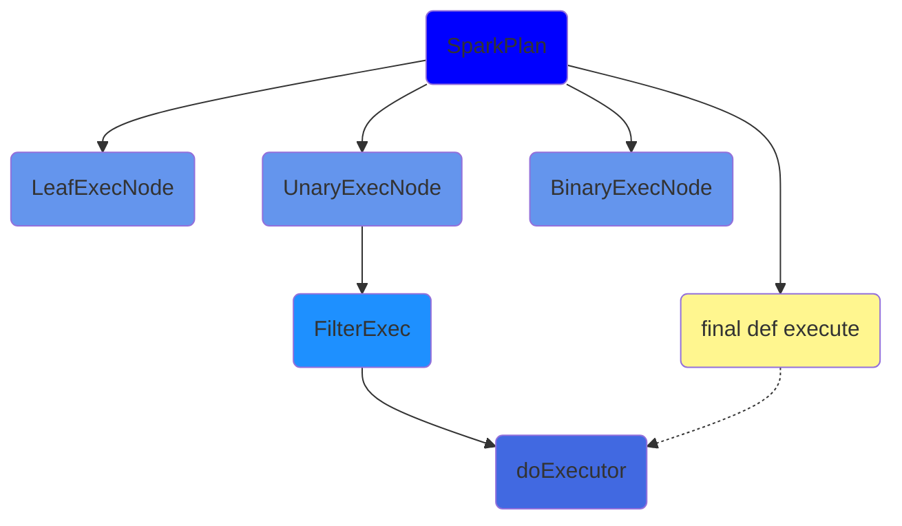

结合图解，即为整个`SQL`执行解析的过程。

------

### 四、什么是或者什么叫执行？

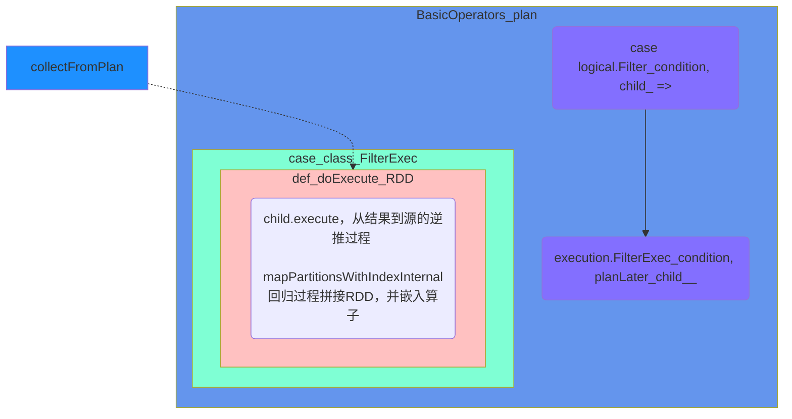

以上流程会和`Spark—CORE`的`RDD`重叠

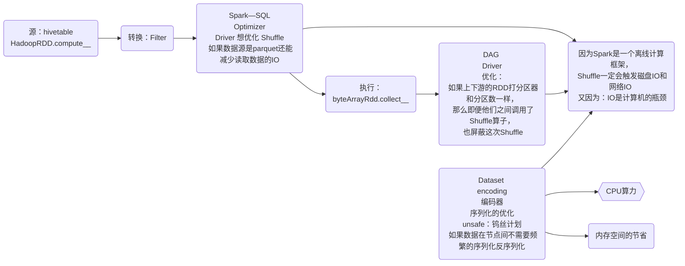

这个流程是基石。

现在所有的计算机系统和软件都没有逃离计算机组成原理和冯诺依曼体系。

------

### 五、总结

至此，分析即是

```mermaid
graph LR
	A{{词法 <br> 语法分析 <br> Parser <br> token}} --> B(AST <br> Node)
	style A fill:#DA70D6
	style B fill:#CD5555
	A --> C(ANTLRV4)
	style C fill:#FF0000
	
	B --> D{Analyzed}
	style D fill:#CD5555
	D --> E([MetaStore])
	style E fill:#CD8500
	E --> F[select a from test]
	F --> F_1[df.createTempView_test_]
	style F_1 fill:#7AC5CD
	F --> F_2[s.enableSupportHive__ <br> s.sql]
	style F_2 fill:#7AC5CD
	
	D --> G{optimizedPlan}
	style G fill:#CD5555
	G --> G_1[成本：Hive <br> 规则：Spark]
	style G_1 fill:#2F4F4F
	
	G --> H{physicalPlan}
	style H fill:#CD5555
	I[object <br> Dataset] --> J[Logical]
	style I fill:#32CD32
	style J fill:#0000CD
	J --> H
	
	H --> K
	K{RDD优化} --> K_1[DAGScheduler]
	style K fill:#CD5555
	style K_1 fill:#5D478B
	
	A_1[object] --> A_1_1[sql其实是字符串]
	style A_1 fill:#32CD32
	style A_1_1 fill:#228B22
	A_1_1 --> A
	
	A --> A_2([写SQL的方式])
	style A_2 fill:#FFF68F
	A_2 --> A_2_1[spark-shell.sh <br> spark-sql.sh <br> thriftserver+beeline jdbc]
	style A_2_1 fill:#C0FF3E
```

以上宏观的流程。

------

# 后续`Spark—Streaming`分析与学习详见`Spark—Streaming.md`。
