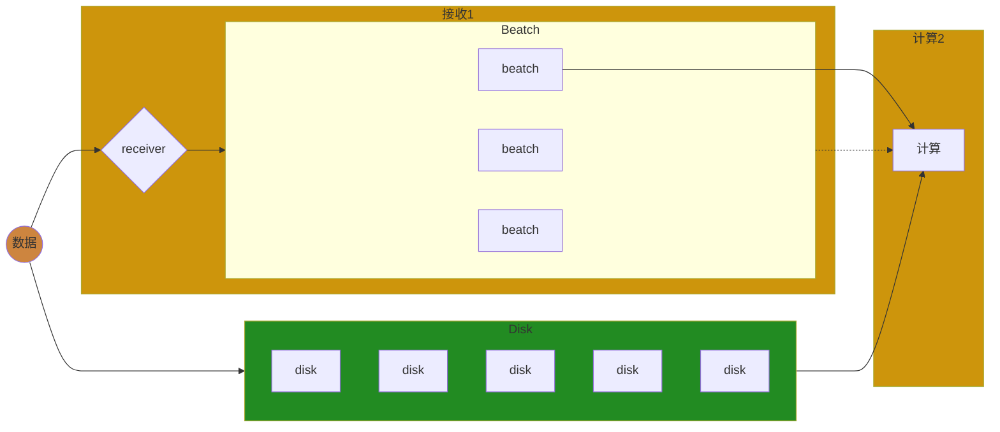
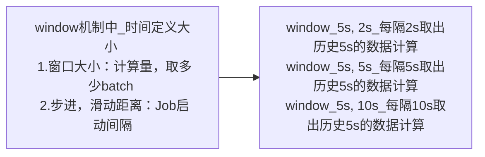
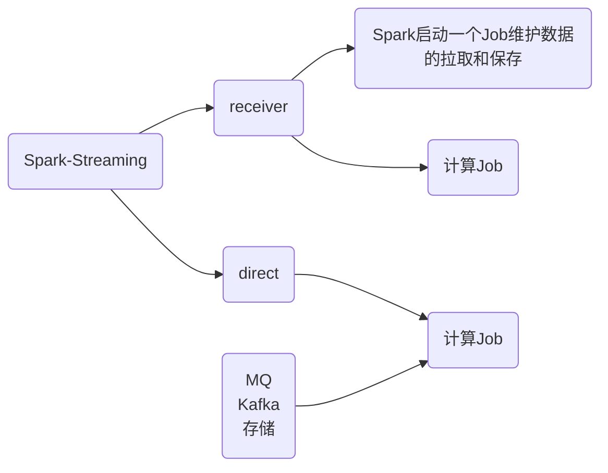
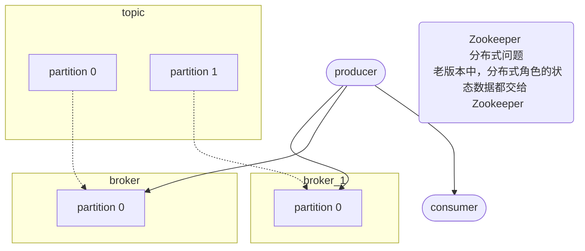

[TOC]

------

# `Spark—Streaming`学习

------

## 章节`34`：`Spark—Streaming`，流式计算之微批计算原理及`Standlone`

------

### 前言

无论是先前学习过的`MapReduce`，`Spark—CORE`，`Spark—Streaming`都脱离不了一种计算模型，即**批量计算**。

这个模型是跑批的，那么什么叫批量计算？

#### 分类

##### 数据

对于数据来说分为**有界**和**无界**。

###### 有界数据

这个界限的含义是**大小**或**数量**。

###### 无界数据

数据**一直会增长**。

但是如此分类其实较为不准确，其实它们应该取决于时间维度。


------

### 语义

什么是聚合？

想要聚合一起的数据它们要有一个共同的特征，在编程中一般用键值对的这种数据表示形式来做聚合。即`reduceByKey`、`combineByKey`等等。

流水线式是以**一条记录**为单位，批量计算是以**若干条记录**为单位。同理**`Kafka`不能精确到每一条记录的颗粒度**，或者追踪是不可能实现的因为它是微批的你只能注意到批次。为什么？你的一批数据在此处加工完后虽然一批中的每一条记录它有`offset`，但是它们只要`Shuffle`计算后，结果集下一步集中的数据就无从得知它曾经来自于哪一条记录。也就无从得知未来数据有没有全部消费完整。

纯流式的它的粒度是在一条反而更好追踪每条记录的消费级别。

|   数据形式/特点   |          增加 \| 阻塞          |
| :---------------: | :----------------------------: |
|       有界        | 不会增加的数据，计算完要等很久 |
|       无界        | 数据会增加，计算完马上还得计算 |
| **计算形式/特点** |          **最小单位**          |
|       批量        | 最小单位是各批次（若干条记录） |
|       流式        |   最小单位是记录（一条记录）   |
| **计算时效/特点** |            **界限**            |
|       离线        |         有界批量的数据         |
|       实时        |          无界流式计算          |

------

### 对比

- 有界数据更偏向离线计算，通常会有`next()`、`hasNext()`。且非常适合迭代器模式。

- 无界数据更适合做实时计算，有数据就可以跑。一条一条走流水线而不是像批量模式够批次才跑。如果用迭代器模式等于还要阻塞，得不偿失通过流水线式更为高效。

**二者类似于`pull & push`的区别。**其实纯流式也适用于批量计算，最终会发现，这个世界上计算的形式有两种

1. 所谓的跑批的形式，批量计算和流式计算都可以使用。
2. 所谓的纯流式，流水线的方式，无论流式计算或批量计算其实都可以用。

------

### 总结

在有界数据中跑一次可能就成功了，无界数据中可能要跑很多的微批。如果真要分清好坏的话，流水线式可能很难触发一个`combiner`，纯流式计算没有这个概念，因为这个节点它只能看到`record01`、`record02`它们之间没有积压。

有界数据的批量计算中还有鸡鸭的概念可以充分发挥`combiner`的压缩数据，让下游拉取的快一些延迟少一些。

不要把流式计算非常生硬地想成实时计算，因为最终要加入把时间维度，看如何取时间。有界数据中也可以使用跑批的方式并不是这种纯流水线的方式才能够解决无界的实时发生的计算。

------

### 一、`Spark—Streaming`

微批的计算形式。



#### 1.1————`Streaming`案例

```scala
package com.syndra.bigdata.streaming

import org.apache.spark.SparkConf
import org.apache.spark.streaming.dstream.{DStream, ReceiverInputDStream}
import org.apache.spark.streaming.{Seconds, StreamingContext}

/**
 * Spark Streaming Receiver
 */
object Lesson01_Receiver01 {
  def main(args: Array[String]): Unit = {
    val conf: SparkConf = new SparkConf().setAppName("Spark_Streaming").setMaster("local")
    // 微批的流式计算, 时间去定义批次(while --> 时间间隔触发 Job)
    val sc: StreamingContext = new StreamingContext(conf, Seconds(5))
    sc.sparkContext.setLogLevel("ERROR")

    // 接收数据源地址
    val dataDStream: ReceiverInputDStream[String] = sc.socketTextStream("192.168.93.155", 8888)
    // 相当于 hello world
    val flatDStream: DStream[String] = dataDStream.flatMap(_.split(" "))
    val resDStream: DStream[(String, Int)] = flatDStream.map((_, 1)).reduceByKey(_ + _)
    // 输出算子
    resDStream.print()
    // 执行算子
    sc.start()
    // 阻塞程序
    sc.awaitTermination()
  }
}
```

运行前要在一台主机上**监听`8888`**，如下图


通过主机向`Streaming`发送数据，如下图


但是`Streaming`并没有对应提示，如下图


为什么会这样？可以看到有一条**`WARN StreamingContext: spark.master should be set as local[n], n > 1 in local mode if you have receivers to get data, otherwise Spark jobs will not get resources to process the received data.`**提示，在本地模式时，上面的`Master`就不能只写一个`local`。默认后面加了一个中括号然后其中放了一个`1`代表只有一个线程一个`Executor`即`local[1]`。

##### 1.1.2—————`local`的线程

接收数据要一个线程，发送数据也要一个线程，如果在同一个线程中那么就会阻塞。其实会有两个线程，如下图


其中一个创建`RDD`它会消耗一个`Stage`，如下图


`Stage`最终会变成一个`Task`且一定会运行在`local`的线程中，如下图


设置`local[9]`后，可以看到如下图

![local[9]](D:\ideaProject\bigdata\bigdata-spark\image\local9.png)

于此同时`Job`的变化，如下图


再次发送数据，如下图


此时`Streaming`成功接收到数据，如下图


但是此时会发现一个问题，那就是数据无序。

本地发送数据到`Streaming`，如下图


可以看到一系列的监控信息。那么批次之间是否有阻塞？

如果一个批次的任务它执行时间比较久，它会阻塞后面的批次执行，如下图


------

### 二、总结

以上为`Streaming`的基本用法。

------

## 章节`35`：`Spark—Streaming`，`API`，`HA`，检查点，窗口等机制

------

### 一、一个`batch`一个`Job`，孤立

`Spark`在`2.3.x`中预先告知`1ms`级的纯流式计算。

```scala
package com.syndra.bigdata.streaming

import org.apache.spark.streaming.dstream.{DStream, ReceiverInputDStream}
import org.apache.spark.streaming.{Duration, StreamingContext}
import org.apache.spark.{SparkConf, SparkContext}

/**
 * DStream API
 */
object Lesson03_DStream_API {
  def main(args: Array[String]): Unit = {
    val conf: SparkConf = new SparkConf().setAppName("TEST_DStream_API").setMaster("local[8]")
    val sc: SparkContext = new SparkContext(conf)
    sc.setLogLevel("ERROR")
    /*
    * Spark Streaming 100ms batch 1ms
    * Low Level API
    * */
    val ssc: StreamingContext = new StreamingContext(sc, Duration(1000))

    /*
    * 1.需求 : 将计算延缓
    * 2.一个数据源, 要保证 1m 级的数据频率和 5m 级的输出频率
    * 3.而且, 是在数据输出的时候计算输出时间点的历史数据
    *
    * 数据源是 1s 中一个 hello 2个 hi
    * */

    // 数据源的粗粒度 : 1s 来自于 StreamContext
    val resource: ReceiverInputDStream[String] = ssc.socketTextStream("localhost", 8889)

    val format: DStream[(String, Int)] = resource.map(_.split(" ")).map(x => (x(0), x(1).toInt))
    val res1s1Batch: DStream[(String, Int)] = format.reduceByKey(_ + _)
    res1s1Batch.mapPartitions(iter => {
      println("1s");
      iter
    }).print() /* 打印频率 : 1s 打印 1次 */

    // 5s 窗口
    val newDS: DStream[(String, Int)] = format.window(Duration(5000))

    // 5个 batch
    val res5s5Batch: DStream[(String, Int)] = newDS.reduceByKey(_ + _)
    res5s5Batch.mapPartitions(iter => {
      println("5s");
      iter
    }).print() /* 打印频率 : 5s 打印 1次...1s 打印 1次 */

    ssc.start()
    ssc.awaitTermination()
  }
}
```

可以让窗口`window`更加细粒度

```scala
val newDS: DStream[(String, Int)] = format.window(Duration(5000), Duration(5000))
```

- 第一个参数表示窗口大小
- 第二个参数表示滑动距离

这两个参数会有多种组合方式



根据业务而定。而且窗口的粒度取决于`StreamingContext()`最好是为倍数关系。

#### 1.1————`window`的粒度

假设**每秒中看到历史 5s 的统计**，以下的`reduce, res`会存在问题

```scala
val reduce: DStream[(String, Int)] = format.reduceByKey(_ + _) // 窗口是 1000, Slide 是 1000
val res: DStream[(String, Int)] = reduce.window(Duration(5000))

val win: DStream[(String, Int)] = format.window(Duration(5000)) // 先调整量
val res1: DStream[(String, Int)] = win.reduceByKey(_ + _) // 在基于上一步的量上整体发生计算
```

其实一直有窗口的概念，`window`的粒度默认取决于`StreamingContext()`的默认设置

```scala
// 最小粒度 约等于 : win大小为 1000, slide 滑动距离也是 1000
val ssc: StreamingContext = new StreamingContext(sc, Duration(1000))
```

`Spark`也是非常贴心的基于此的`API → reduceByKeyAndWindow()`

```scala
val res: DStream[(String, Int)] = format.reduceByKeyAndWindow(_ + _, Duration(5000))
```

------

### 二、转换

一共两种途径

#### 2.1————第一种`transform`

中途加工`RDD`

```scala
// 1.transform : 先转换成 RDD, 然后再进行操作
val res: DStream[(String, Int)] = format.transform( // 硬性要求 : 返回值是 RDD
  rdd => {
    rdd.foreach(println) // 产生 Job
    val rddRes: RDD[(String, Int)] = rdd.map(x => (x._1, x._2 * 10)) // 只是在转换
    rddRes
  }
)
```

把`RDD`传给了一个函数，我们只需要写出这个函数即可。

其实`transform`中它也能拿到`RDD`，他是要求你必须最后还返回`RDD`，那么也就代表着这其中你可以写`Action`，也可以不写。但是无论如何最后这个函数还得返回`RDD`，换而言之，可以你给我一个`RDD`，我可以令这个`RDD`进行`foreach`打印其中的内容，但是除了要打印的话。最终还拿这个`RDD`去做一个转换，然后再输出返回转换完的`RDD`再输出出去。输出回去后得到了一个`format.transform`。等于其中有几个`Action`算子就会有几个分支被调起。

#### 2.2————第二种`foreachRDD`

末端处理

```scala
// 2.foreachRDD : 直接对 RDD 进行操作, 末端处理
format.foreachRDD( // StreamingContext 有一个独立的线程执行 while(true), 在主线程的代码是放到执行线程去执行
  rdd => {
    rdd.foreach(print)
    // x...to Redis
    // to MySQL
    // call WebService
  }
)
```

**如果在其中调`rdd.map()`算子但并未调用`Action`算子，那么对应操作不会触发`DAGScheduler`也就不会被执行。**

`foreach`其实是一种遍历集合数据的方式，那么现在是一个流一个时间线中`DStream`可以处理很多批次。`foreachRDD`就是处理每一个批次但是在某一个时间点某一个`Job`中，只能拿到一个处理`Job`中的这一个`RDD`。那么这一个`RDD`要怎么去处理？拿着`RDD`然后要调一个`Action`算子处理其中的逻辑所有的元素。

`StreamingContext`有一个独立的线程执行`while(true)`，在主线程的代码是放到执行线程去执行。

最终要明白，其实`Spark`的核心是`CORE`也就是`RDD`。`RDD`是有链的概念，一个`RDD`可以重复使用。一个数据可以有`N`种执行结果这是`RDD`的概念。

#### 2.3————作用域

`DStream`转换到`RDD`的作用域有三个级别

- **`Application`**
- **`Job`**
- **`Task`**

**`RDD`是一个单向链表，`DStream`也是一个单向链表**。如果把最后一个`DStream`给`ssc`，那么`ssc`可以启动一个独立的线程无`while(true) {最后一个DStream遍历}`。

```scala
var bc: Broadcast[List[Int]] = null
var jobNum = 0
println("Son of a bitch Syndra") // Application 级别
val res: DStream[(String, Int)] = format.transform(
  rdd => {
    // 每 Job 级别递增, 是在 ssc 的另一个 while(true) 线程中, Driver 端执行的
    jobNum += 1
    println(s"jobNum : $jobNum")
    if (jobNum <= 1) {
      bc = sc.broadcast((1 to 5).toList)
    } else {
      bc = sc.broadcast((6 to 15).toList)
    }
    // 无论多少次 Job 的运行都是相同的 bc, 只有 rdd 接受的函数, 才是 Executor 端的 才是 Task 端的
    rdd.filter(x => {
      bc.value.contains(x._2)
    })
  }
)
```

------

### 三、总结

------

#### 3.1————窗口的概念

窗口可大可小，可以是一个批次，因为它是一个批次的流计算，一个批次就是一个窗口或者是连续多个批次，想一次计算的时候就一次计算。计算时是看历史的多个批次，还是一次计算的时候只看历史的一个批次。其实不设置`winodow`相关的参数它一个批次也是按照一个窗口来做的。只不过`Duration`的一个批次的大小就是一个窗口。

#### 3.2————关于计算时的转换方式

在转换的时候它有一个`foreachRDD`还有一个`transform`这么两类的转换操作。

其中`foreachRDD`是触底的，其实都是最重要拿到`RDD`，只不过拿到`RDD`在`foreachRDD`中是最后必须有一个`Action`先前的`DStream`才能生效。

如果是在`transform`中，其实是在把`RDD`传出去，但是中间的时候还可以调`Action`只不过是另外一条线。

其实总的来说就是如果让`DStream`从头到尾执行的话，**`foreachRDD`中必须有`Action`，`transform`后续必须要有一个动作**。这就是两种方式的本质区别。

------

## 章节`36`：`Spark—Streaming`，整合`MQ—Kafka`开启

------

### 前言

之前的操作只分析了`reveiver`模式，也就是所有数据均由`Spark`整理。这些批次数据是通过`Spark`跑一个单独的作业定时然后拉取回来。

除此之外还有另外**两种模式**分别为

- **`direct`**
- **有状态计算**

------

### 一、有状态计算

无论是一个批次窗口还是`N`个批次窗口，它只要产生`Job`的时候，是根据窗口大小拿过来的数据进行计算的，要么拿一个批次计算要么拿若干批次计算，那么在往前的历史那些数据它的价值以及状态就丢失了。

所以无论窗口做的多大，它其实叫做无状态的。只是说这个`Job`一起的时候，我自己当前有一个状态历史是什么状态我并不知道。但是此时却往往需要有一个状态。

#### 1.1————什么是状态？

其实就是一个历史数据。也就是说新增的数据要参考历史数据做一个怎样的计算？

此时整个数据是根据状态变化发生的。无论是`Flink`还是其他的流式计算只要涉及关联或`Join`的操作。

##### 1.1.1—————什么是关联？

历史的计算要存下来，当前的计算最后还要合到历史数据中。对此`Spark`原生虽然每个批次跑完后`Job`会消失，但可以通过持久化历史的数据状态，那么未来的计算就可以从其中取出。

```scala
// 第一次把这一个 key 的数据全拿过来, 放在内存中然后更新, 容易 OOM
updateStateByKey(updateFunc: (Seq[V], Option[S]) => Option[S])
```

第一个参数为一批新数据，第二个参数为老数据的一个状态。

```scala
val data: ReceiverInputDStream[String] = ssc.socketTextStream("localhost", 8889)
val mapData: DStream[(String, Int)] = data.map(_.split(" ")).map(x => (x(0), 1))
//    mapData.reduceByKey(_ + _)
val res: DStream[(String, Int)] = mapData.updateStateByKey((nv: Seq[Int], ov: Option[Int]) => {
  // 每个批次的 Job 中, 对着 nv 求和
  val cnt: Int = nv.count(_ > 0)
  val oldVal: Int = ov.getOrElse(0)
  Some(cnt + oldVal)
})
```

但是它还需要一个持久化路径保存数据。此写法未来要写入到靠谱的持久层，例如：`HDFS`等等。

```scala
sc.setCheckpointDir("D:\\ideaProject\\bigdata\\bigdata-spark")
```

##### 1.1.2—————关于持久化

此时，如果站在架构师的角度，关于持久化，有两个概念。

- `persist`：存储在`BlockManager`，速度快

- `checkpoint`：它是外界系统，成本高，但可靠性好，例如`HDFS`

**也可以做`persist`调用后再做`checkpoint →`数据会在这两个地方都存储**。所以`updateStateByKey()`算子在这次计算完那个数据要输出最后结果的状态数据一定是先`persist`到本机，然后同时`checkpoint`到`HDFS`。下一批次计算时，其实没有动用`checkpoint`，而是动用了本机的`persist`的结果参与计算，最后植入一个单向输出到`checkpoint`中。

#### 1.2————有状态计算下的窗口移动

那么在窗口移动的过程中

1. 可以每次重新计算窗口数据
2. 也可以，加上进来的减去出去的

有以上两种计算方式，这取决于**窗口的大小**和**移动的数据的量的变化**。显然第二种方式快，但是此方式也要求数据必须有状态。

每秒拿出历史`5`条数据参与计算

```scala
// 数据源的粗粒度 : 1s 来自于 StreamContext
val resource: ReceiverInputDStream[String] = ssc.socketTextStream("localhost", 8889)
val format: DStream[(String, Int)] = resource.map(_.split(" ")).map(x => (x(0), 1))
val res: DStream[(String, Int)] = format.reduceByKeyAndWindow(
  (ov: Int, nv: Int) => {
    ov + nv
  }, Duration(5000), Duration(1000))
res.print()
```

使用第二种方式计算窗口数据

```scala
// 数据源的粗粒度 : 1s 来自于 StreamContext
val resource: ReceiverInputDStream[String] = ssc.socketTextStream("localhost", 8889)
val format: DStream[(String, Int)] = resource.map(_.split(" ")).map(x => (x(0), 1))
// 调优 :
val res: DStream[(String, Int)] = format.reduceByKeyAndWindow(
  // 计算新进入的 batch 的数据
  (ov: Int, nv: Int) => {
    println("被调起...")
    ov + nv
  },
  // 挤出去的 batch 的数据
  (ov: Int, oov: Int) => {
    ov - oov
  },
  Duration(5000), Duration(1000))
res.print()
```

在趋向于稳定时，第一个函数会被调起三次，第二个函数会被调起两次。因为是基于`key`做计算。

`reduceByKey`是对`combineByKey`的封装，`combineByKey`有三个函数

- 放入函数
- 聚合函数
- `combine`函数

在处理时，其实要传给它一个函数。传给它的这个函数并不是放入函数。第一条记录怎么操作以及关于这个`key`的后续记录怎么操作是聚合函数。

那么为什么第一个函数会被调起三次，其实`reduceByKey`会默认生成一个放入函数就是这个记录怎么卸载就怎么出去，我们写的这个

```scala
(ov: Int, nv: Int) => {
  println("被调起...")
  ov + nv
}
```

函数是一个聚合函数。什么叫做聚合函数？

也就是说某一笔记录它有两条的时候才能调到它

```scala
def reduceByKey(func: (V, V) => V): RDD[(K, V)] = self.withScope {
  reduceByKey(defaultPartitioner(self), func)
}

def reduceByKey(partitioner: Partitioner, func: (V, V) => V): RDD[(K, V)] = self.withScope {
  // 如果这个 key 有第二个 value 才会调用我们给定的函数 func
  combineByKeyWithClassTag[V]((v: V) => v, func, func, partitioner)
}
```

注意，`reduceByKey`调用`combineByKey`时，第一条记录并不是我们给定，而是函数自行提供。

也就是说，如果是`reduceByKeyAndWindow`的话或未来调`reduceByKey`时，都要非常小心一件事情，就是传给他的函数并不是说每条记录都会去调起，它是一个聚合函数中间这个

```scala
(ov: Int, nv: Int) => {
  println("被调起...")
  ov + nv
}
```

函数它并不是放入函数。除非自行实现`combineByKey`，

#### 1.3————调优

1. 全亮有状态，所以依赖持久化
2. 调优，窗口有状态（**历史状态**对**窗口滑动**的**进入**，**出去**进行计算），依赖持久化
3. 如果窗口计算，不需要调优、不需要持久化，但是每次都是窗口量全量的计算
4. 对`reduceByKey`的函数要非常清楚
5. 窗口有状态调优计算：逻辑是否会正确
6. 企业中最终使用`mapWithState()`来做全量有状态计算

**一个比较极端的例子**： `5min 1`个窗口量`2s`刷新大屏，`2s`的`Slide`滑动范围那计算量是`5min`的积压，可能计算不过来，权衡了一下，虽然`checkpoint`有损耗，但是对于`5min`积压的量的计算快很多。

#### 1.4————`mapWithState`算子

由`key`对应的那一条记录，以及历史状态，逐条更新。总比`updateStateByKey`的取出一个`key`的所有数据放内存中然后更新要好。

区别是`mapWithState`更新`KV`，`updateStateByKey`更新一个`K`的所有数据。

```scala
val data: ReceiverInputDStream[String] = ssc.socketTextStream("localhost", 8889)
val mapData: DStream[(String, Int)] = data.map(_.split(" ")).map(x => (x(0), 1))

mapData.mapWithState(StateSpec.function(
  (k: String, nv: Option[Int], ov: State[Int]) => {
    println(s"=====K: $k, NV: ${nv.getOrElse()}, OV: ${ov.getOption().getOrElse(0)}=====")
    // K, V
    (k, nv.getOrElse(0) + ov.getOption.getOrElse(0))
  }
))
```

和`updateStateByKey`不同的是，`mapWithState`每次都会调我们给定的函数。

**其实每一条记录会调一次函数和一批数据调一次函数这是俩概念。**

------

### 二、什么是`Kafka`？





#### 2.1————重复消费

`Kafka`比较值钱的就是**持久化**。为了解决重复消费的问题，引入了`group`的概念，也是根据需求推导出的。

#### 2.2————有序问题

那么如果生产的顺序和消费顺序不一致，也就是怎么解决有序的问题？

- `Kafka`中只能保证分区有序，因为在任何并行度分布情况下，节点间协商数据的顺序成本很高，所以它就放弃了节点间的顺序，即不保证节点间的顺序

在分布式下，还有`AKF`原则。

#### 2.3————`Zookeeper`的分布式问题

因为在分布式情况下，在所谓的微服务中，**强调进程或角色的无状态**，也就是说你别把你自己干的事儿都放到你的内存中，如果挂了那么你曾经干到哪别人都不知道。

老版本中，`consumer`的`offset`、元数据，状态信息都放到了`Zookeeper`中，那么会发现中间的访问频率不是很高，然而`group`的`IO`和通信频率一定会极高。`consumer`端一定会依赖`Zookeeper`的响应速度。**如果`consumer`挂掉后再重启会参照`offset`继续正确消费，记录没有重复消费的概念。所以会对`Zookeeper`压力很大。**

不光`Kafka`，早期`HBase`等等技术都把所有的状态元数据信息以及频繁变化的数据都依赖于`Zookeeper`，因为他们开始的时候认为`Zokeeper`解决分布协调问题的确很好，大家也应该这么去用它。但是随着时间的推移发现了`Zookeeper`扛不住了。因为它是一种**简单的框架运行时可用的主从概念，他所有的增删改的操作是压到主然后再去做统一视图两端的提交**。所以速度其实再快再快在并发情况下，它也是扛不住的，因为主是一台，它不是真的`Paxos`那种无主集群。

其实真正的无主集群也不可能达到特别快，这种消息同步一致性的问题就像区块链一样，它绝对不可能达到毫秒级，一个人一个操作就更上去了反而它速度更慢。

所以此时`Zookeeper`可能会成两端拖后腿的事请，也可以考虑将状态等信息写入到`Redis`中，但引入一个新技术可能会带来另一个问题，`Redis`的可靠性，使用一台`Redis`不开启持久化，那么它挂掉之后状态数据全没了，整个公司就瘫了因为你并不知道上次处理到哪条记录，如果消息重复消费的话有多给别人打了十万块钱，此时`Redis`需要做主从。

其实`Redis`还是一种**滞后的最终一致性**，**有可能丢数据**。可以开启强一致性这会面临增加延迟的问题。那么如果团队没人会`Redis`，这将会面临扩招新的团队以及运维成本的问题。

`MySQL`的元数据是自行维护在`mysql`库中，那么`Kafka`也可以这么做，用过一个`topic`维护元数据信息从而降低对`Zookeeper`的依赖只要性能`hold`住。

在**架构师的角度**来看，一句话，**别让它干不属于它的事**。**一个架构师知道这个技术什么特征就用在什么地方，如果你知道这个技术的特点，却不用它，知道它的缺点反而在缺点上做了很多事，那么我认为这不是一个合格的架构师。**

`Spark—Streaming`结合`Kafka`，**必问的一个问题：`offset`怎么维护？直接维护到`Kafka`中，顶多在维护一个什么时候写`offset`，是读了数据写，还是读了数据之后处理数据，处理完再写，还是读了数据处理的时候处理完要发生事务整体数据写成功之后再去写。**

只不过要找一个合适的时间点就有不同的语义了。是最多消费一次还是至少消费的还是绝对只消费一次？这就是比较细粒度的决策需要根据业务调整。

------

# 后续详见`Spark—Streaming_源码.md`。
