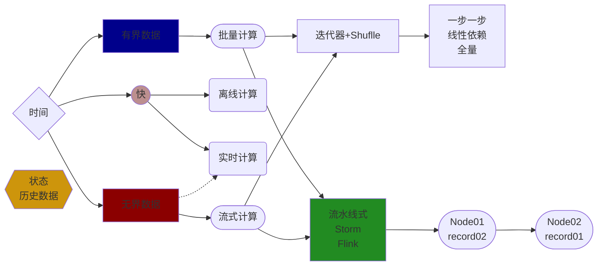
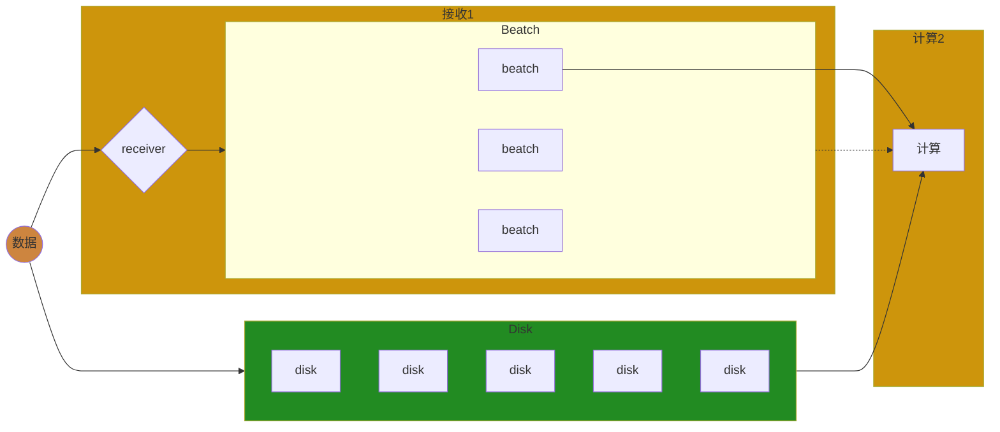

# Spark—Streaming学习

------

## 章节`34`：`Spark—Streaming`，流式计算之微批计算原理及`Standlone`

------

### 前言

无论是先前学习过的`MapReduce`，`Spark—CORE`，`Spark—Streaming`都脱离不了一种计算模型，即**批量计算**。

这个模型是跑批的，那么什么叫批量计算？

#### 分类

##### 数据

对于数据来说分为**有界**和**无界**。

###### 有界数据

这个界限的含义是**大小**或**数量**。

###### 无界数据

数据**一直会增长**。

但是如此分类其实较为不准确，其实它们应该取决于时间维度。



------

### 语义

什么是聚合？

想要聚合一起的数据它们要有一个共同的特征，在编程中一般用键值对的这种数据表示形式来做聚合。即`reduceByKey`、`combineByKey`等等。

流水线式是以**一条记录**为单位，批量计算是以**若干条记录**为单位。同理**`Kafka`不能精确到每一条记录的颗粒度**，或者追踪是不可能实现的因为它是微批的你只能注意到批次。为什么？你的一批数据在此处加工完后虽然一批中的每一条记录它有`offset`，但是它们只要`Shuffle`计算后，结果集下一步集中的数据就无从得知它曾经来自于哪一条记录。也就无从得知未来数据有没有全部消费完整。

纯流式的它的粒度是在一条反而更好追踪每条记录的消费级别。

|   数据形式/特点   |          增加 \| 阻塞          |
| :---------------: | :----------------------------: |
|       有界        | 不会增加的数据，计算完要等很久 |
|       无界        | 数据会增加，计算完马上还得计算 |
| **计算形式/特点** |          **最小单位**          |
|       批量        | 最小单位是各批次（若干条记录） |
|       流式        |   最小单位是记录（一条记录）   |
| **计算时效/特点** |            **界限**            |
|       离线        |         有界批量的数据         |
|       实时        |          无界流式计算          |

------

### 对比

- 有界数据更偏向离线计算，通常会有`next()`、`hasNext()`。且非常适合迭代器模式。

- 无界数据更适合做实时计算，有数据就可以跑。一条一条走流水线而不是像批量模式够批次才跑。如果用迭代器模式等于还要阻塞，得不偿失通过流水线式更为高效。

**二者类似于`pull & push`的区别。**其实纯流式也适用于批量计算，最终会发现，这个世界上计算的形式有两种

1. 所谓的跑批的形式，批量计算和流式计算都可以使用。
2. 所谓的纯流式，流水线的方式，无论流式计算或批量计算其实都可以用。

------

### 总结

在有界数据中跑一次可能就成功了，无界数据中可能要跑很多的微批。如果真要分清好坏的话，流水线式可能很难触发一个`combiner`，纯流式计算没有这个概念，因为这个节点它只能看到`record01`、`record02`它们之间没有积压。

有界数据的批量计算中还有鸡鸭的概念可以充分发挥`combiner`的压缩数据，让下游拉取的快一些延迟少一些。

不要把流式计算非常生硬地想成实时计算，因为最终要加入把时间维度，看如何取时间。有界数据中也可以使用跑批的方式并不是这种纯流水线的方式才能够解决无界的实时发生的计算。

------

### 一、`Spark—Streaming`

微批的计算形式。



#### 1.1————`Streaming`案例

```scala
package com.syndra.bigdata.streaming

import org.apache.spark.SparkConf
import org.apache.spark.streaming.dstream.{DStream, ReceiverInputDStream}
import org.apache.spark.streaming.{Seconds, StreamingContext}

/**
 * Spark Streaming Receiver
 */
object Lesson01_Receiver01 {
  def main(args: Array[String]): Unit = {
    val conf: SparkConf = new SparkConf().setAppName("Spark_Streaming").setMaster("local")
    // 微批的流式计算, 时间去定义批次(while --> 时间间隔触发 Job)
    val sc: StreamingContext = new StreamingContext(conf, Seconds(5))
    sc.sparkContext.setLogLevel("ERROR")

    // 接收数据源地址
    val dataDStream: ReceiverInputDStream[String] = sc.socketTextStream("192.168.93.155", 8888)
    // 相当于 hello world
    val flatDStream: DStream[String] = dataDStream.flatMap(_.split(" "))
    val resDStream: DStream[(String, Int)] = flatDStream.map((_, 1)).reduceByKey(_ + _)
    // 输出算子
    resDStream.print()
    // 执行算子
    sc.start()
    // 阻塞程序
    sc.awaitTermination()
  }
}
```

运行前要在一台主机上**监听`8888`**，如下图


通过主机向`Streaming`发送数据，如下图


但是`Streaming`并没有对应提示，如下图


为什么会这样？可以看到有一条**`WARN StreamingContext: spark.master should be set as local[n], n > 1 in local mode if you have receivers to get data, otherwise Spark jobs will not get resources to process the received data.`**提示，在本地模式时，上面的`Master`就不能只写一个`local`。默认后面加了一个中括号然后其中放了一个`1`代表只有一个线程一个`Executor`即`local[1]`。

##### 1.1.2—————`local`的线程

接收数据要一个线程，发送数据也要一个线程，如果在同一个线程中那么就会阻塞。其实会有两个线程，如下图


其中一个创建`RDD`它会消耗一个`Stage`，如下图


`Stage`最终会变成一个`Task`且一定会运行在`local`的线程中，如下图


设置`local[9]`后，可以看到如下图

![local[9]](D:\ideaProject\bigdata\bigdata-spark\image\local9.png)

于此同时`Job`的变化，如下图


再次发送数据，如下图


此时`Streaming`成功接收到数据，如下图


但是此时会发现一个问题，那就是数据无序。

本地发送数据到`Streaming`，如下图


可以看到一系列的监控信息。那么批次之间是否有阻塞？

如果一个批次的任务它执行时间比较久，它会阻塞后面的批次执行，如下图


------

### 二、总结

以上为`Streaming`的基本用法。

------

## 章节`35`：`Spark—Streaming`，`API`，`HA`，检查点，窗口等机制

------

