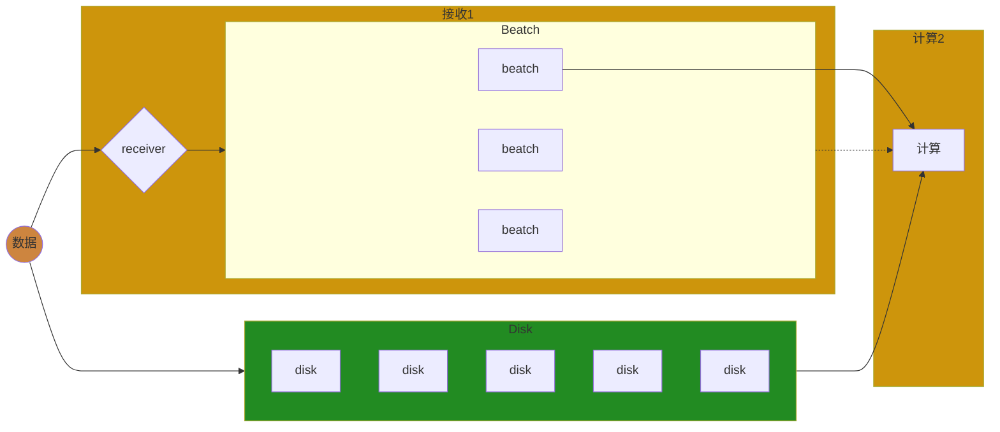
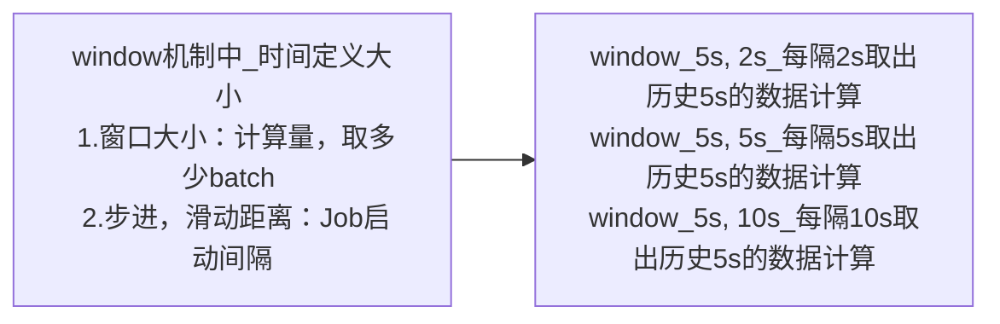

# Spark—Streaming学习

------

## 章节`34`：`Spark—Streaming`，流式计算之微批计算原理及`Standlone`

------

### 前言

无论是先前学习过的`MapReduce`，`Spark—CORE`，`Spark—Streaming`都脱离不了一种计算模型，即**批量计算**。

这个模型是跑批的，那么什么叫批量计算？

#### 分类

##### 数据

对于数据来说分为**有界**和**无界**。

###### 有界数据

这个界限的含义是**大小**或**数量**。

###### 无界数据

数据**一直会增长**。

但是如此分类其实较为不准确，其实它们应该取决于时间维度。


------

### 语义

什么是聚合？

想要聚合一起的数据它们要有一个共同的特征，在编程中一般用键值对的这种数据表示形式来做聚合。即`reduceByKey`、`combineByKey`等等。

流水线式是以**一条记录**为单位，批量计算是以**若干条记录**为单位。同理**`Kafka`不能精确到每一条记录的颗粒度**，或者追踪是不可能实现的因为它是微批的你只能注意到批次。为什么？你的一批数据在此处加工完后虽然一批中的每一条记录它有`offset`，但是它们只要`Shuffle`计算后，结果集下一步集中的数据就无从得知它曾经来自于哪一条记录。也就无从得知未来数据有没有全部消费完整。

纯流式的它的粒度是在一条反而更好追踪每条记录的消费级别。

|   数据形式/特点   |          增加 \| 阻塞          |
| :---------------: | :----------------------------: |
|       有界        | 不会增加的数据，计算完要等很久 |
|       无界        | 数据会增加，计算完马上还得计算 |
| **计算形式/特点** |          **最小单位**          |
|       批量        | 最小单位是各批次（若干条记录） |
|       流式        |   最小单位是记录（一条记录）   |
| **计算时效/特点** |            **界限**            |
|       离线        |         有界批量的数据         |
|       实时        |          无界流式计算          |

------

### 对比

- 有界数据更偏向离线计算，通常会有`next()`、`hasNext()`。且非常适合迭代器模式。

- 无界数据更适合做实时计算，有数据就可以跑。一条一条走流水线而不是像批量模式够批次才跑。如果用迭代器模式等于还要阻塞，得不偿失通过流水线式更为高效。

**二者类似于`pull & push`的区别。**其实纯流式也适用于批量计算，最终会发现，这个世界上计算的形式有两种

1. 所谓的跑批的形式，批量计算和流式计算都可以使用。
2. 所谓的纯流式，流水线的方式，无论流式计算或批量计算其实都可以用。

------

### 总结

在有界数据中跑一次可能就成功了，无界数据中可能要跑很多的微批。如果真要分清好坏的话，流水线式可能很难触发一个`combiner`，纯流式计算没有这个概念，因为这个节点它只能看到`record01`、`record02`它们之间没有积压。

有界数据的批量计算中还有鸡鸭的概念可以充分发挥`combiner`的压缩数据，让下游拉取的快一些延迟少一些。

不要把流式计算非常生硬地想成实时计算，因为最终要加入把时间维度，看如何取时间。有界数据中也可以使用跑批的方式并不是这种纯流水线的方式才能够解决无界的实时发生的计算。

------

### 一、`Spark—Streaming`

微批的计算形式。



#### 1.1————`Streaming`案例

```scala
package com.syndra.bigdata.streaming

import org.apache.spark.SparkConf
import org.apache.spark.streaming.dstream.{DStream, ReceiverInputDStream}
import org.apache.spark.streaming.{Seconds, StreamingContext}

/**
 * Spark Streaming Receiver
 */
object Lesson01_Receiver01 {
  def main(args: Array[String]): Unit = {
    val conf: SparkConf = new SparkConf().setAppName("Spark_Streaming").setMaster("local")
    // 微批的流式计算, 时间去定义批次(while --> 时间间隔触发 Job)
    val sc: StreamingContext = new StreamingContext(conf, Seconds(5))
    sc.sparkContext.setLogLevel("ERROR")

    // 接收数据源地址
    val dataDStream: ReceiverInputDStream[String] = sc.socketTextStream("192.168.93.155", 8888)
    // 相当于 hello world
    val flatDStream: DStream[String] = dataDStream.flatMap(_.split(" "))
    val resDStream: DStream[(String, Int)] = flatDStream.map((_, 1)).reduceByKey(_ + _)
    // 输出算子
    resDStream.print()
    // 执行算子
    sc.start()
    // 阻塞程序
    sc.awaitTermination()
  }
}
```

运行前要在一台主机上**监听`8888`**，如下图


通过主机向`Streaming`发送数据，如下图


但是`Streaming`并没有对应提示，如下图


为什么会这样？可以看到有一条**`WARN StreamingContext: spark.master should be set as local[n], n > 1 in local mode if you have receivers to get data, otherwise Spark jobs will not get resources to process the received data.`**提示，在本地模式时，上面的`Master`就不能只写一个`local`。默认后面加了一个中括号然后其中放了一个`1`代表只有一个线程一个`Executor`即`local[1]`。

##### 1.1.2—————`local`的线程

接收数据要一个线程，发送数据也要一个线程，如果在同一个线程中那么就会阻塞。其实会有两个线程，如下图


其中一个创建`RDD`它会消耗一个`Stage`，如下图


`Stage`最终会变成一个`Task`且一定会运行在`local`的线程中，如下图


设置`local[9]`后，可以看到如下图

![local[9]](D:\ideaProject\bigdata\bigdata-spark\image\local9.png)

于此同时`Job`的变化，如下图


再次发送数据，如下图


此时`Streaming`成功接收到数据，如下图


但是此时会发现一个问题，那就是数据无序。

本地发送数据到`Streaming`，如下图


可以看到一系列的监控信息。那么批次之间是否有阻塞？

如果一个批次的任务它执行时间比较久，它会阻塞后面的批次执行，如下图


------

### 二、总结

以上为`Streaming`的基本用法。

------

## 章节`35`：`Spark—Streaming`，`API`，`HA`，检查点，窗口等机制

------

### 一、一个`batch`一个`Job`，孤立

`Spark`在`2.3.x`中预先告知`1ms`级的纯流式计算。

```scala
package com.syndra.bigdata.streaming

import org.apache.spark.streaming.dstream.{DStream, ReceiverInputDStream}
import org.apache.spark.streaming.{Duration, StreamingContext}
import org.apache.spark.{SparkConf, SparkContext}

/**
 * DStream API
 */
object Lesson03_DStream_API {
  def main(args: Array[String]): Unit = {
    val conf: SparkConf = new SparkConf().setAppName("TEST_DStream_API").setMaster("local[8]")
    val sc: SparkContext = new SparkContext(conf)
    sc.setLogLevel("ERROR")
    /*
    * Spark Streaming 100ms batch 1ms
    * Low Level API
    * */
    val scc: StreamingContext = new StreamingContext(sc, Duration(1000))

    /*
    * 1.需求 : 将计算延缓
    * 2.一个数据源, 要保证 1m 级的数据频率和 5m 级的输出频率
    * 3.而且, 是在数据输出的时候计算输出时间点的历史数据
    *
    * 数据源是 1s 中一个 hello 2个 hi
    * */

    // 数据源的粗粒度 : 1s 来自于 StreamContext
    val resource: ReceiverInputDStream[String] = scc.socketTextStream("localhost", 8889)

    val format: DStream[(String, Int)] = resource.map(_.split(" ")).map(x => (x(0), x(1).toInt))
    val res1s1Batch: DStream[(String, Int)] = format.reduceByKey(_ + _)
    res1s1Batch.mapPartitions(iter => {
      println("1s");
      iter
    }).print() /* 打印频率 : 1s 打印 1次 */

    // 5s 窗口
    val newDS: DStream[(String, Int)] = format.window(Duration(5000))

    // 5个 batch
    val res5s5Batch: DStream[(String, Int)] = newDS.reduceByKey(_ + _)
    res5s5Batch.mapPartitions(iter => {
      println("5s");
      iter
    }).print() /* 打印频率 : 5s 打印 1次...1s 打印 1次 */

    scc.start()
    scc.awaitTermination()
  }
}
```

可以让窗口`window`更加细粒度

```scala
val newDS: DStream[(String, Int)] = format.window(Duration(5000), Duration(5000))
```

- 第一个参数表示窗口大小
- 第二个参数表示滑动距离

这两个参数会有多种组合方式



根据业务而定。而且窗口的粒度取决于`StreamingContext()`最好是为倍数关系。

#### 1.1————`window`的粒度

假设**每秒中看到历史 5s 的统计**，以下的`reduce, res`会存在问题

```scala
val reduce: DStream[(String, Int)] = format.reduceByKey(_ + _) // 窗口是 1000, Slide 是 1000
val res: DStream[(String, Int)] = reduce.window(Duration(5000))

val win: DStream[(String, Int)] = format.window(Duration(5000)) // 先调整量
val res1: DStream[(String, Int)] = win.reduceByKey(_ + _) // 在基于上一步的量上整体发生计算
```

其实一直有窗口的概念，`window`的粒度默认取决于`StreamingContext()`的默认设置

```scala
// 最小粒度 约等于 : win大小为 1000, slide 滑动距离也是 1000
val scc: StreamingContext = new StreamingContext(sc, Duration(1000))
```

`Spark`也是非常贴心的基于此的`API → reduceByKeyAndWindow()`

```scala
val res: DStream[(String, Int)] = format.reduceByKeyAndWindow(_ + _, Duration(5000))
```

------

### 二、转换

一共两种途径

#### 2.1————第一种`transform`

中途加工`RDD`

```scala
// 1.transform : 先转换成 RDD, 然后再进行操作
val res: DStream[(String, Int)] = format.transform( // 硬性要求 : 返回值是 RDD
  rdd => {
    rdd.foreach(println) // 产生 Job
    val rddRes: RDD[(String, Int)] = rdd.map(x => (x._1, x._2 * 10)) // 只是在转换
    rddRes
  }
)
```

把`RDD`传给了一个函数，我们只需要写出这个函数即可。

其实`transform`中它也能拿到`RDD`，他是要求你必须最后还返回`RDD`，那么也就代表着这其中你可以写`Action`，也可以不写。但是无论如何最后这个函数还得返回`RDD`，换而言之，可以你给我一个`RDD`，我可以令这个`RDD`进行`foreach`打印其中的内容，但是除了要打印的话。最终还拿这个`RDD`去做一个转换，然后再输出返回转换完的`RDD`再输出出去。输出回去后得到了一个`format.transform`。等于其中有几个`Action`算子就会有几个分支被调起。

#### 2.2————第二种`foreachRDD`

末端处理

```scala
// 2.foreachRDD : 直接对 RDD 进行操作, 末端处理
format.foreachRDD( // StreamingContext 有一个独立的线程执行 while(true), 在主线程的代码是放到执行线程去执行
  rdd => {
    rdd.foreach(print)
    // x...to Redis
    // to MySQL
    // call WebService
  }
)
```

**如果在其中调`rdd.map()`算子但并未调用`Action`算子，那么对应操作不会触发`DAGScheduler`也就不会被执行。**

`foreach`其实是一种遍历集合数据的方式，那么现在是一个流一个时间线中`DStream`可以处理很多批次。`foreachRDD`就是处理每一个批次但是在某一个时间点某一个`Job`中，只能拿到一个处理`Job`中的这一个`RDD`。那么这一个`RDD`要怎么去处理？拿着`RDD`然后要调一个`Action`算子处理其中的逻辑所有的元素。

`StreamingContext`有一个独立的线程执行`while(true)`，在主线程的代码是放到执行线程去执行。

最终要明白，其实`Spark`的核心是`CORE`也就是`RDD`。`RDD`是有链的概念，一个`RDD`可以重复使用。一个数据可以有`N`种执行结果这是`RDD`的概念。

#### 2.3————作用域

`DStream`转换到`RDD`的作用域有三个级别

- **`Application`**
- **`Job`**
- **`Task`**

**`RDD`是一个单向链表，`DStream`也是一个单向链表**。如果把最后一个`DStream`给`scc`，那么`scc`可以启动一个独立的线程无`while(true) {最后一个DStream遍历}`。

```scala
var bc: Broadcast[List[Int]] = null
var jobNum = 0
println("Son of a bitch Syndra") // Application 级别
val res: DStream[(String, Int)] = format.transform(
  rdd => {
    // 每 Job 级别递增, 是在 scc 的另一个 while(true) 线程中, Driver 端执行的
    jobNum += 1
    println(s"jobNum : $jobNum")
    if (jobNum <= 1) {
      bc = sc.broadcast((1 to 5).toList)
    } else {
      bc = sc.broadcast((6 to 15).toList)
    }
    // 无论多少次 Job 的运行都是相同的 bc, 只有 rdd 接受的函数, 才是 Executor 端的 才是 Task 端的
    rdd.filter(x => {
      bc.value.contains(x._2)
    })
  }
)
```

