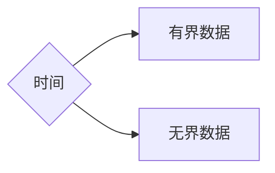

# Spark—Streaming学习

------

## 章节`34`：`Spark—Streaming`，流式计算之微批计算原理及`Standlone`

------

### 前言

无论是先前学习过的`MapReduce`，`Spark—CORE`，`Spark—Streaming`都脱离不了一种计算模型，即**批量计算**。

这个模型是跑批的，那么什么叫批量计算？

#### 分类

##### 数据

对于数据来说分为**有界**和**无界**。

###### 有界数据

这个界限的含义是**大小**或**数量**。

###### 无界数据

数据**一直会增长**。

但是如此分类其实较为不准确，其实它们应该取决于时间维度。

