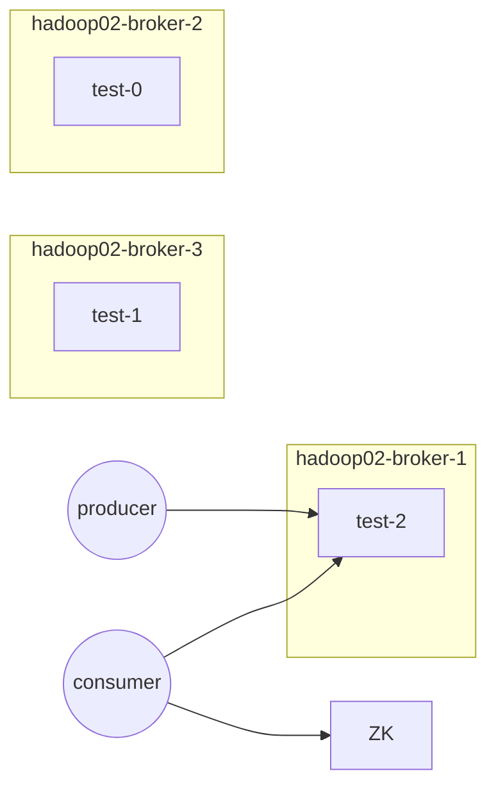

# `Spark—Streaming`源码分析

------

## 章节`37`：`Spark—Streaming`，源码分析，流式微批任务的调度原理

------

### 一、`Spark—StreamingAndKafka`

#### 1.1————规划

1. `hadoop01`：均不部署
2. `hadoop02`：`ZK`，`broker`
3. `hadoop03`：`ZK`，`broker`
4. `hadoop04`：`ZK`，`broker`

##### 1.1.1—————修改`server.properties`

```shell
# 切换到config目录
cd Kafka
cd config
vi server.properties
# 每台机器的id必须不同
broker.id=0
# Kafka的日志存放位置
log.dirs=/var/bigdata/kafka
# Zookeeper的连接配置
# 因为Zookeeper是公用的,如果未来要维护offset,它默认放在根目录下,会被打散
# 因此要给出一个目录 /kafka
zookeeper.connect=hadoop02:2181,hadoop03:2181,hadoop04:2181/kafka
```

##### 1.1.2—————启动`kafka-server`

```shell
# 在config目录下使用配置文件后台运行
kafka-server-start.sh -daemon ./server.properties
```

如下图


`Zookeeper`中的`kafka`目录，如下图


#### 1.2————`kafka`基础操作

##### 1.2.1—————创建存储数据隔离的`topic`

```shell
kafka-topics.sh
# 会给出很多选项
# --zookeeper : 和zk建立连接
# --create --topic : 创建topic
# --partitions 3 : 最终分布式时会有多少个分区
# --replication-factor 2 : 副本因子
kafka-topics.sh --zookeeper hadoop02:2181,hadoop03:2181,hadoop04:2181/kafka --create --topic "test" --partitions 3 --replication-factor 2
```

基于`AKF`原则，数据光分治的话，其中的某一个分区就是`1/N`的数据。那么这个分区如果挂掉的话，其实就会丢失`1/N`的数据，所以一般分布式情况下还强调一个可用性。所以会有`--replication-factor`副本因子。

##### 1.2.2—————查看创建的`topic`

```shell
kafka-topics.sh --zookeeper hadoop02:2181,hadoop03:2181,hadoop04:2181/kafka --list
```

##### 1.2.3—————查看`topic`详情

```shell
kafka-topics.sh --zookeeper hadoop02:2181,hadoop03:2181,hadoop04:2181/kafka --describe --topic test
Topic:test      PartitionCount:3        ReplicationFactor:2     Configs:
        Topic: test     Partition: 0    Leader: 2       Replicas: 2,3   Isr: 2,3
        Topic: test     Partition: 1    Leader: 3       Replicas: 3,1   Isr: 3,1
        Topic: test     Partition: 2    Leader: 1       Replicas: 1,2   Isr: 1,2
```

##### 1.2.4—————`producer`写操作

```shell
# 也可以写多个zk地址 : hadoop02:9092,hadoop03:9092,hadoop04:9092
kafka-console-producer.sh --broker-list hadoop04:9092 --topic test
```

会有很多提示可以输入的东西，但是看不到`Zookeeper`，上边会有一个`--broker-list `。也就是`broker`端不是再去通过找`Zookeeper`注册发现了，想连那个`broker`手动给出即可。减少对`Zookeeper`端的压力，因为以及最后的所有元数据的访问交互的东西都在这个



层次完成，就不要再去依赖`Zookeeper`。这是它的`API`以及框架改变的一个特点。

以上命令行输入`Enter`会阻塞住。

##### 1.2.5—————`consumer`读操作

```shell
kafka-console-consumer.sh --bootstrap-server hadoop02:9092 --topic test
```

此处会出现，之前生产的消息没有被消费到。

```shell
# 查看刚才命令行抓取的数据的consumer
kafka-consumer-groups.sh --bootstrap-server hadoop03:9092 --list
console-consumer-35704
# 查看详情
kafka-consumer-groups.sh --bootstrap-server hadoop03:9092 --describe --group 'console-consumer-35704'
TOPIC           PARTITION  CURRENT-OFFSET  LOG-END-OFFSET  LAG             CONSUMER-ID                                     HOST            CLIENT-ID
test            0          -               0               -               consumer-1-650b193f-79be-461b-8106-ed5e26b0ddcd /192.168.93.147 consumer-1
test            1          -               1               -               consumer-1-650b193f-79be-461b-8106-ed5e26b0ddcd /192.168.93.147 consumer-1
test            2          -               1               -               consumer-1-650b193f-79be-461b-8106-ed5e26b0ddcd /192.168.93.147 consumer-1

```

##### 1.2.6—————查看`kafka`元数据

```shell
kafka-topics.sh --zookeeper hadoop02:2181/kafka --list\
__consumer_offsets
test
```

其中`__consumer_offsets`就是`kafka`的元数据`MetaData`。

```shell
# 查看MetaData详情
kafka-topics.sh --zookeeper hadoop02:2181/kafka --describe --topic '__consumer_offsets'
Topic:__consumer_offsets        PartitionCount:50       ReplicationFactor:1     Configs:segment.bytes=104857600,cleanup.policy=compact,compression.type=producer
        Topic: __consumer_offsets       Partition: 0    Leader: 2       Replicas: 2     Isr: 2
        Topic: __consumer_offsets       Partition: 1    Leader: 3       Replicas: 3     Isr: 3
        Topic: __consumer_offsets       Partition: 2    Leader: 1       Replicas: 1     Isr: 1
        Topic: __consumer_offsets       Partition: 3    Leader: 2       Replicas: 2     Isr: 2
        Topic: __consumer_offsets       Partition: 4    Leader: 3       Replicas: 3     Isr: 3
        Topic: __consumer_offsets       Partition: 5    Leader: 1       Replicas: 1     Isr: 1
        Topic: __consumer_offsets       Partition: 6    Leader: 2       Replicas: 2     Isr: 2
        Topic: __consumer_offsets       Partition: 7    Leader: 3       Replicas: 3     Isr: 3
        Topic: __consumer_offsets       Partition: 8    Leader: 1       Replicas: 1     Isr: 1
        Topic: __consumer_offsets       Partition: 9    Leader: 2       Replicas: 2     Isr: 2
        Topic: __consumer_offsets       Partition: 10   Leader: 3       Replicas: 3     Isr: 3
        Topic: __consumer_offsets       Partition: 11   Leader: 1       Replicas: 1     Isr: 1
        Topic: __consumer_offsets       Partition: 12   Leader: 2       Replicas: 2     Isr: 2
        Topic: __consumer_offsets       Partition: 13   Leader: 3       Replicas: 3     Isr: 3
        Topic: __consumer_offsets       Partition: 14   Leader: 1       Replicas: 1     Isr: 1
        Topic: __consumer_offsets       Partition: 15   Leader: 2       Replicas: 2     Isr: 2
        Topic: __consumer_offsets       Partition: 16   Leader: 3       Replicas: 3     Isr: 3
        Topic: __consumer_offsets       Partition: 17   Leader: 1       Replicas: 1     Isr: 1
        Topic: __consumer_offsets       Partition: 18   Leader: 2       Replicas: 2     Isr: 2
        Topic: __consumer_offsets       Partition: 19   Leader: 3       Replicas: 3     Isr: 3
        Topic: __consumer_offsets       Partition: 20   Leader: 1       Replicas: 1     Isr: 1
        Topic: __consumer_offsets       Partition: 21   Leader: 2       Replicas: 2     Isr: 2
        Topic: __consumer_offsets       Partition: 22   Leader: 3       Replicas: 3     Isr: 3
        Topic: __consumer_offsets       Partition: 23   Leader: 1       Replicas: 1     Isr: 1
        Topic: __consumer_offsets       Partition: 24   Leader: 2       Replicas: 2     Isr: 2
        Topic: __consumer_offsets       Partition: 25   Leader: 3       Replicas: 3     Isr: 3
        Topic: __consumer_offsets       Partition: 26   Leader: 1       Replicas: 1     Isr: 1
        Topic: __consumer_offsets       Partition: 27   Leader: 2       Replicas: 2     Isr: 2
        Topic: __consumer_offsets       Partition: 28   Leader: 3       Replicas: 3     Isr: 3
        Topic: __consumer_offsets       Partition: 29   Leader: 1       Replicas: 1     Isr: 1
        Topic: __consumer_offsets       Partition: 30   Leader: 2       Replicas: 2     Isr: 2
        Topic: __consumer_offsets       Partition: 31   Leader: 3       Replicas: 3     Isr: 3
        Topic: __consumer_offsets       Partition: 32   Leader: 1       Replicas: 1     Isr: 1
        Topic: __consumer_offsets       Partition: 33   Leader: 2       Replicas: 2     Isr: 2
        Topic: __consumer_offsets       Partition: 34   Leader: 3       Replicas: 3     Isr: 3
        Topic: __consumer_offsets       Partition: 35   Leader: 1       Replicas: 1     Isr: 1
        Topic: __consumer_offsets       Partition: 36   Leader: 2       Replicas: 2     Isr: 2
        Topic: __consumer_offsets       Partition: 37   Leader: 3       Replicas: 3     Isr: 3
        Topic: __consumer_offsets       Partition: 38   Leader: 1       Replicas: 1     Isr: 1
        Topic: __consumer_offsets       Partition: 39   Leader: 2       Replicas: 2     Isr: 2
        Topic: __consumer_offsets       Partition: 40   Leader: 3       Replicas: 3     Isr: 3
        Topic: __consumer_offsets       Partition: 41   Leader: 1       Replicas: 1     Isr: 1
        Topic: __consumer_offsets       Partition: 42   Leader: 2       Replicas: 2     Isr: 2
        Topic: __consumer_offsets       Partition: 43   Leader: 3       Replicas: 3     Isr: 3
        Topic: __consumer_offsets       Partition: 44   Leader: 1       Replicas: 1     Isr: 1
        Topic: __consumer_offsets       Partition: 45   Leader: 2       Replicas: 2     Isr: 2
        Topic: __consumer_offsets       Partition: 46   Leader: 3       Replicas: 3     Isr: 3
        Topic: __consumer_offsets       Partition: 47   Leader: 1       Replicas: 1     Isr: 1
        Topic: __consumer_offsets       Partition: 48   Leader: 2       Replicas: 2     Isr: 2
        Topic: __consumer_offsets       Partition: 49   Leader: 3       Replicas: 3     Isr: 3
```

至此，`kafka`搭建成功。

------

### 二、`kafka-API`

```xml
<!-- https://mvnrepository.com/artifact/org.apache.spark/spark-streaming-kafka-0-10 -->
<dependency>
  <groupId>org.apache.spark</groupId>
  <artifactId>spark-streaming-kafka-0-10_2.11</artifactId>
  <version>2.3.4</version>
</dependency>
```

`Producer`端

```scala
package com.syndra.bigdata.streaming

import org.apache.kafka.clients.producer.{KafkaProducer, ProducerConfig, ProducerRecord, RecordMetadata}
import org.apache.kafka.common.serialization.StringSerializer

import java.util.Properties
import java.util.concurrent.Future

/**
 * Kafka Producer
 */
object Lesson04_Kafka_Producer {
  def main(args: Array[String]): Unit = {
    val pros = new Properties()
    pros.put(ProducerConfig.BOOTSTRAP_SERVERS_CONFIG, "hadoop02:9092,hadoop03:9092,hadoop04:9092")
    pros.put(ProducerConfig.KEY_SERIALIZER_CLASS_CONFIG, classOf[StringSerializer])
    pros.put(ProducerConfig.VALUE_SERIALIZER_CLASS_CONFIG, classOf[StringSerializer])
    val producer = new KafkaProducer[String, String](pros)

    while (true) {
      for (i <- 1 to 3; j <- 1 to 3) {
        val record = new ProducerRecord[String, String]("test", s"item$j", s"action$i")
        val records: Future[RecordMetadata] = producer.send(record)
        val metadata: RecordMetadata = records.get()
        val partition: Int = metadata.partition()
        val offset: Long = metadata.offset()
        println(s"item$j action$i partition: $partition, offset: $offset")
      }
//      Thread.sleep(1000)
    }
    producer.close()
  }
}

```

`Consumer`端

```scala
package com.syndra.bigdata.streaming

import org.apache.kafka.clients.consumer.{ConsumerConfig, ConsumerRebalanceListener, ConsumerRecord, ConsumerRecords, KafkaConsumer}
import org.apache.kafka.common.TopicPartition
import org.apache.kafka.common.serialization.StringDeserializer

import java.time.Duration
import java.util
import java.util.Properties
import java.util.regex.Pattern

/**
 * Kafka Consumer
 */
object Lesson04_Kafka_Consumer {
  def main(args: Array[String]): Unit = {
    val pros = new Properties()
    pros.put(ConsumerConfig.BOOTSTRAP_SERVERS_CONFIG, "hadoop04:9092")
    pros.put(ConsumerConfig.KEY_DESERIALIZER_CLASS_CONFIG, classOf[StringDeserializer])
    pros.put(ConsumerConfig.VALUE_DESERIALIZER_CLASS_CONFIG, classOf[StringDeserializer])

    // earliest 按 CURRENT-OFFSET 特殊状态 group第一创建时, 0
    // latest 按 LOG-END-OFFSET
    pros.put(ConsumerConfig.AUTO_OFFSET_RESET_CONFIG, "latest")
    pros.put(ConsumerConfig.ENABLE_AUTO_COMMIT_CONFIG, "TRUE")
    pros.put(ConsumerConfig.GROUP_ID_CONFIG, "t2")

    val consumer = new KafkaConsumer[String, String](pros)

    consumer.subscribe(Pattern.compile("test"), new ConsumerRebalanceListener {
      override def onPartitionsRevoked(partitions: util.Collection[TopicPartition]): Unit = {
        println("onPartitionsRevoked")
        val iter: util.Iterator[TopicPartition] = partitions.iterator()
        while (iter.hasNext) {
          println(iter.next())
        }
      }

      override def onPartitionsAssigned(partitions: util.Collection[TopicPartition]): Unit = {
        println(s"onPartitionsAssigned")
        val iter: util.Iterator[TopicPartition] = partitions.iterator()
        while (iter.hasNext) {
          println(iter.next())
        }
        // 调用了一个数据库
        consumer.seek(new TopicPartition("test", 1), 22)
        Thread.sleep(5000)
      }
    })

    while (true) {
      val records: ConsumerRecords[String, String] = consumer.poll(Duration.ofMillis(0).toMillis)

      if (!records.isEmpty) {
        println(s"----------${records.count()}----------")
        val iter: util.Iterator[ConsumerRecord[String, String]] = records.iterator()
        while (iter.hasNext) {
          val record: ConsumerRecord[String, String] = iter.next()
          val topic: String = record.topic()
          val partition: Int = record.partition()
          val offset: Long = record.offset()

          val key: String = record.key()
          val value: String = record.value()
          println(s"key: $key value: $value partition: $partition offset: $offset")
        }
      }
    }
  }
}

```

`offset`无论是存到`ZK`还是`kafka`还是数据库，那个叫持久化。换言之`consumer`客户端在运行时，它在自己的进程中会维护自己消费到什么位置。其实维不维护都是一回事，它其实就是开启了线程循环要消息。持久化是解决程序重启后的问题。

我们在哪个点上用我们所谓的自定义`offset`是在程序启动时

```scala
// 调用了一个数据库
consumer.seek(new TopicPartition("test", 1), 22)
Thread.sleep(5000)
```

代码在以上位置执行，负载均衡或故障转移时，是由先前记录消费到的位置，后来者由此参考继续在正确位置消费，而没有重复消费的概念。

#### 2.1————维护`offset`

手动维护`offset`有**两类地方**

1. **手动维护到`kafka`**
2. **其他的任何地方：`ZK`，`MySQL`**

防止丢失数据！

#### 2.2————总结`kafka—Consumer`

1. 自动维护`offset`：`ENABLE_AUTO_COMMIT_CONFIG true`，`poll`数据后先去写`offset`，再去计算，会有丢失数据
2. 手动维护`offset`：`ENABLE_AUTO_COMMIT_CONFIG false`
   1. 维护到`kafka`自己的`__consumer_offsets`这个`topic`中，且还能通过`kafka-consumer-groups.sh`查看
   2. 维护到其他的位置：`MySQL`，`ZK`
      1. 牵扯到通过：`ConsumerRebalanceListener`的`def onPartitionsAssigned(partitions: util.Collection[TopicPartition])`回调后，自己`seek`到查询的位置
3. `AUTO_OFFSET_RESET_CONFIG`：自适应的，且必须参考`__consumer_offsets`维护的数据
   1. `earliest`：按`CURRENT-OFFSET`特殊状态`group`第一创建时，0
   2. `latest`：按`LOG-END-OFFSET`
4. `seek`：覆盖性最强，即便使用自适应维护，但是一旦出现`seek`一定会覆盖之前所有的配置。来自于人工指令要么来自曾经维护到外界的参考持久化的位置

------

### 三、总结

`producer`关注的是`key`的设计，如果想保证商品的事务完成性，那么一定用商品`ID`作为`key`。如果是用人的身份证`ID`号作为`key`那么要维护的是关于这一个人的东西的事务完成性。并按顺序打入到指定分区中。

`consumer`只要消费分区数据一定是按照顺序的，而且`key`只能出现在一个分区中不能出现在其他分区中，同理之前分析过的`Shuffle`的概念。只不过`consumer`在消费时，第一步先参考`offset`，`offset`可以来自于`__consumer_offsets`，也可以来自于第三方。

注意，如果想使用第三方就要用`seek`，且只在程序启动时会有一个所谓的参考方向。`consumer`会自行维护在内存中运行时消费位置`offset`。

一个`partition`在一个`group`中只能对应一个`consumer`，一个`consumer`在一个`group`中可以对应多个`partition`。

------

## 章节`38`：`Spark—Streaming`

------

### 一、`StreamingonKafka`的整合

```scala
package com.syndra.bigdata.streaming

import org.apache.kafka.clients.consumer.{ConsumerConfig, ConsumerRecord}
import org.apache.kafka.common.serialization.StringDeserializer
import org.apache.spark.SparkConf
import org.apache.spark.streaming.dstream.{DStream, InputDStream}
import org.apache.spark.streaming.kafka010.{ConsumerStrategies, KafkaUtils, LocationStrategies}
import org.apache.spark.streaming.{Duration, StreamingContext}

/**
 * 在Kafka数据源上做Streaming计算
 */
object Lesson05_Spark_Kafka_Consumer {
  def main(args: Array[String]): Unit = {
    // 写一个Spark-StreamingOnKafka
    val conf: SparkConf = new SparkConf().setMaster("local[10]").setAppName("StreamingOnKafka")
    val ssc: StreamingContext = new StreamingContext(conf, Duration(1000))

    // 如何得到Kafka的DStream?
    val map: Map[String, Object] = Map[String, Object](
      (ConsumerConfig.BOOTSTRAP_SERVERS_CONFIG, "hadoop04:9092"),
      (ConsumerConfig.KEY_DESERIALIZER_CLASS_CONFIG, classOf[StringDeserializer]),
      (ConsumerConfig.VALUE_DESERIALIZER_CLASS_CONFIG, classOf[StringDeserializer]),
      (ConsumerConfig.GROUP_ID_CONFIG, "t6"),
      (ConsumerConfig.AUTO_OFFSET_RESET_CONFIG, "earliest"),
      (ConsumerConfig.ENABLE_AUTO_COMMIT_CONFIG, "TRUE")
    )

    val kafka: InputDStream[ConsumerRecord[String, String]] = KafkaUtils.createDirectStream[String, String](
      ssc,
      LocationStrategies.PreferConsistent,
      ConsumerStrategies.Subscribe[String, String](List("test"), map)
    )

    // 通过KafkaUtils得到的第一个DStream要先去转换下, 其实这个DStream就是consumer@poll回来的records
    // 将record转换成业务逻辑的元素 : 只提取key, value
    val dStream: DStream[(String, (String, String, Int, Long))] = kafka.map(
      record => {
        val t: String = record.topic()
        val p: Int = record.partition()
        val o: Long = record.offset()
        val k: String = record.key()
        val v: String = record.value()
        (k, (v, t, p, o))
      }
    )
    dStream.print()

    ssc.start()
    ssc.awaitTermination()
  }
}

```

**值得注意的是：**通过`KafkaUtils`得到的第一个`DStream`要先去转换下, 其实这个`DStream`就是`consumer@poll`回来的`records`。将`record`转换成业务逻辑的元素`→`只提取`key,value`。

以下为消费结果

```shell
-------------------------------------------
Time: 1738062570000 ms
-------------------------------------------
(null,(hello Syndra,test,1,0))
(item1,(action1,test,1,1))
(item1,(action2,test,1,2))
(item1,(action3,test,1,3))
(item1,(action1,test,1,4))
(item1,(action2,test,1,5))
(item1,(action3,test,1,6))
(item1,(action1,test,1,7))
(item1,(action2,test,1,8))
(item1,(action3,test,1,9))
...

-------------------------------------------
Time: 1738062571000 ms
-------------------------------------------
```

第二个`Job`没有输出，潜台词就是在`SparkonKafka`默认情况下，第一次的时候会尽量拉回所有的。显然这种行为就会有风险。

- 冷启动，它会造成一次大量拉取
- 每个批次的冷启动也会拉取很多数据，尽量拉取更多数据

```scala
// 约束消费能力, 每次一条拉取
(ConsumerConfig.MAX_POLL_RECORDS_CONFIG, "1")
```

但是此参数并不生效，要在`SparkConf()`中配置。

```properties
// 未来运行,上一个Job拉的多下一个Job就拉少点,反压的方式
spark.streaming.backpressure.enabled
// 冷启动拉取的数据量
spark.streaming.backpressure.initialRate
// 处理完当前的批次
spark.streaming.stopGracefullyOnShutdown
```

在以上配置后，再次运行会发现

```shell
-------------------------------------------
Time: 1738064933000 ms
-------------------------------------------
(null,(Fucking Syndra,test,0,0))
(null,(hello Syndra,test,2,0))
(null,(hello Syndra,test,1,0))

-------------------------------------------
Time: 1738064934000 ms
-------------------------------------------
(item2,(action1,test,0,1))
(item3,(action1,test,2,1))
(item1,(action1,test,1,1))

-------------------------------------------
Time: 1738064935000 ms
-------------------------------------------
(item2,(action2,test,0,2))
(item3,(action2,test,2,2))
(item1,(action2,test,1,2))
```

也就是说，这些配置中，比较强硬的是

```scala
conf.set("spark.streaming.kafka.maxRatePerPartition", "1")
conf.set("spark.streaming.backpressure.initialRate", "5")
```

如果以上配置同时开启，最终要参考`maxRatePerPartition`每次一个分区拉取多少条。

但此时自动提交`offset`为`true`，即拉取数据已经把`offset`更新了然后再去计算，如果计算失败了那很抱歉，`offset`已经被更新完了肯定会丢数据。

真正企业级应用时，一定会改为`false`。

------

### 二、`Kafka`如何维护`offset`？

通俗来说，如果一个`Job`起来后，它有三个`Task`，三个`consumer`，是不是每个自己去维护自己的`offset`。每个`consumer`最清楚自己的消费的是哪个`topic`哪个`partition`以及拿到的`offset`是多少。那么它只要消费成功了就把`offset`更新一下，找地方存起来。也就是在分布式情况下，每个`consumer`自行维护`offset`。

维护`offset`应该放在哪合适？批计算什么时候跑起来的谁去控制？以批次为单位的离线计算，通过`Driver`控制，且批次间是线性阻塞的。由此得出结论**`Driver`控制`Job`，`Job`中有批次的概念。也就是`Driver`维护`offset`。**

1. 关闭失败重试（并不好）
2. 解耦：文件的方式（最古老且系统间影响最小，尤其银行中）
3. 开启事务
   1. `OK`：如果不是记录、表级的锁，把事务和锁放的非常非常松的情况下，并行这件事才行
   2. `repartition:1`：在某一步让它们变成一个分区，所有行为不破坏`Job`的完整性
4. `collect`：一个事务中既先去把数据写成功，然后再把`offset`写成功，最后再`commit`

#### 2.1————面试题：消费`Kafka offset`的管理上有几种方式？

参照以上。

------

### 三、维护`offset`是为了什么？哪个时间点用起你维护的`offset`?

是在`Application`重启时，`Driver`重启时。

第一个版本

```scala
// 完成业务代码后_V1
// 因为提交offset代码写到了main线程中, 其实没有起到作用
kafka.foreachRDD(
  rdd => {
    // Driver端可以拿到offset
    val ranges: Array[OffsetRange] = rdd.asInstanceOf[HasOffsetRanges].offsetRanges
    // 闭包, 通过KafkaUtils得到的第一个DStream向上转型, 提交offset
    kafka.asInstanceOf[CanCommitOffsets].commitAsync(ranges)
  }
)
```

第二个版本

```scala
// 完成业务代码后_V2
var ranges: Array[OffsetRange] = null
// 正确的, 将提交offset的代码放到DStream对象的接收函数中, 那么未来再调度线程中, 这个函数每个Job有机会调用一次, 伴随着提交offset
kafka.foreachRDD(
  rdd => {
    // Driver端可以拿到offset
    ranges = rdd.asInstanceOf[HasOffsetRanges].offsetRanges
    // 闭包, 通过KafkaUtils得到的第一个DStream向上转型, 提交offset
    //        kafka.asInstanceOf[CanCommitOffsets].commitAsync(ranges)
  }
)
kafka.asInstanceOf[CanCommitOffsets].commitAsync(ranges)
```

第三个版本

```scala
// 完成业务代码后_V3
var ranges: Array[OffsetRange] = null
kafka.foreachRDD(
  rdd => {
    // Driver端可以拿到offset
    ranges = rdd.asInstanceOf[HasOffsetRanges].offsetRanges
    // 闭包, 通过KafkaUtils得到的第一个DStream向上转型, 提交offset
    kafka.asInstanceOf[CanCommitOffsets].commitAsync(ranges, new OffsetCommitCallback {
      // 异步提交offset, 调完后回来可能成功也可能失败
      // callback有一个缺陷 : 异步提交的方式略微有延迟
      //
      override def onComplete(offsets: util.Map[TopicPartition, OffsetAndMetadata], exception: Exception): Unit = {
        if (offsets != null) {
          ranges.foreach(println)
          println("----------")
          val iter: util.Iterator[TopicPartition] = offsets.keySet().iterator()
          while (iter.hasNext) {
            val k: TopicPartition = iter.next()
            val v: OffsetAndMetadata = offsets.get(k)
            println(s"${k.partition()}...${v.offset()}")
          }
        }
      }
    })
  }
)
```

维护`offset`的另一个语义是什么：持久化。

在使用第三方维护数据时，`kafka`数据源要修改，以及`MySQL`

```scala
val kafka: InputDStream[ConsumerRecord[String, String]] = KafkaUtils.createDirectStream[String, String](
  ssc,
  LocationStrategies.PreferConsistent,
  // 访问数据库, 取曾经持久化的offset
  Map(
    (new TopicPartition("from mysql topic", 0), 33),
    (new TopicPartition("from mysql topic", 1), 32)
  )
)

var ranges: Array[OffsetRange] = null
kafka.foreachRDD(
  rdd => {
    // Driver端可以拿到offset
    ranges = rdd.asInstanceOf[HasOffsetRanges].offsetRanges
    // 闭包, 通过KafkaUtils得到的第一个DStream向上转型, 提交offset
    kafka.asInstanceOf[CanCommitOffsets].commitAsync(ranges, new OffsetCommitCallback {
      // 异步提交offset, 调完后回来可能成功也可能失败
      // callback有一个缺陷 : 异步提交的方式略微有延迟
      // 1.维护/持久化offset到kafka
      override def onComplete(offsets: util.Map[TopicPartition, OffsetAndMetadata], exception: Exception): Unit = {
        if (offsets != null) {
          ranges.foreach(println)
          println("----------")
          val iter: util.Iterator[TopicPartition] = offsets.keySet().iterator()
          while (iter.hasNext) {
            val k: TopicPartition = iter.next()
            val v: OffsetAndMetadata = offsets.get(k)
            println(s"${k.partition()}...${v.offset()}")
          }
        }
      }
    })
    // 2.维护/持久化到MySQL异步维护或同步
    // 同步
    val local: Array[(String, String)] = rdd.map(r => (r.key(), r.value())).reduceByKey(_ + _).collect()
    // 开启事务, 提交数据, 提交offset, commit
  }
)
```

------

### 四、总结
